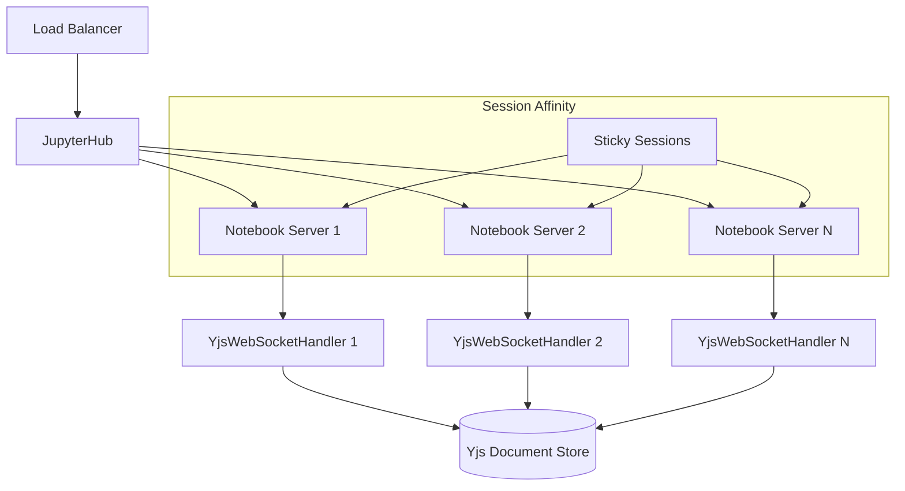

# Collaborative Editing Administrator Guide

This guide provides comprehensive instructions for deploying and managing Jupyter Notebook v7's collaborative editing capabilities in enterprise environments.

## Overview

Jupyter Notebook v7 introduces real-time collaborative editing powered by Yjs CRDT (Conflict-free Replicated Data Type) technology, enabling multiple users to simultaneously edit notebooks with sub-100ms synchronization latency. This enterprise deployment guide covers JupyterHub integration, server configuration, permissions management, and scalable deployment architectures.

### Key Features

- **Real-time collaborative editing** with conflict-free synchronization
- **User presence awareness** showing active collaborators and cursor positions
- **Cell-level locking mechanism** preventing editing conflicts
- **Fine-grained permissions system** supporting view-only, edit, and admin roles
- **Comment and review system** for collaborative feedback
- **Enterprise JupyterHub integration** with seamless authentication
- **Scalable WebSocket architecture** supporting 5-50 concurrent users per notebook

## Prerequisites

### System Requirements

- **Python**: 3.9+ for async WebSocket handling
- **JupyterLab**: 4.5+ components for compatibility
- **Node.js**: 16+ for building frontend components
- **Memory**: Additional 50MB per active collaborative notebook
- **CPU**: 2-3x overhead during high-frequency editing periods
- **Network**: ~10KB/s additional bandwidth per active collaborator

### Required Dependencies

#### Frontend Dependencies
```json
{
  "yjs": "^13.5.40",
  "y-websocket": "^1.4.0", 
  "y-protocols": "^1.0.5",
  "lib0": "^0.2.0",
  "@jupyterlab/collaboration": "^4.5.0"
}
```

#### Backend Dependencies
```python
# requirements.txt
jupyter-server>=2.4.0,<3
pycrdt>=0.3.0
tornado>=6.2.0
```

## JupyterHub Integration

### Authentication Configuration

The collaborative editing system integrates seamlessly with JupyterHub's authentication tokens, extending them with role-based permissions.

#### 1. JupyterHub Configuration

Add the following to your `jupyterhub_config.py`:

```python
# Enable collaboration service
c.JupyterHub.services = [
    {
        'name': 'notebook-collaboration',
        'url': 'http://127.0.0.1:8889',
        'command': ['python', '-m', 'jupyter_collaboration'],
        'environment': {
            'JUPYTERHUB_API_TOKEN': '{HUB_SERVICE_API_TOKEN}',
            'JUPYTERHUB_CLIENT_ID': 'service-notebook-collaboration',
            'JUPYTERHUB_API_URL': 'http://127.0.0.1:8081/hub/api',
        }
    }
]

# Configure spawner for collaboration
c.Spawner.default_url = '/notebooks'
c.Spawner.environment = {
    'JUPYTER_ENABLE_COLLABORATION': '1',
    'COLLABORATION_SERVICE_URL': 'ws://127.0.0.1:8889/api/collaboration'
}

# Set up user permissions
c.JupyterHub.load_roles = [
    {
        'name': 'notebook-viewer',
        'description': 'View-only access to notebooks',
        'scopes': ['read:notebooks', 'access:collaboration'],
        'users': ['viewer1', 'viewer2']
    },
    {
        'name': 'notebook-editor', 
        'description': 'Edit access to notebooks',
        'scopes': ['read:notebooks', 'write:notebooks', 'access:collaboration'],
        'users': ['editor1', 'editor2']
    },
    {
        'name': 'notebook-admin',
        'description': 'Full administrative access',
        'scopes': ['admin:notebooks', 'manage:collaboration'],
        'users': ['admin1']
    }
]
```

#### 2. Token Extension for Permissions

The collaboration system extends JupyterHub tokens with role information:

```python
# In your custom authenticator or spawner
def get_collaboration_permissions(self, user):
    """Extract collaboration permissions from user roles."""
    permissions = {
        'view': True,  # Default view permission
        'edit': False,
        'admin': False
    }
    
    for role in user.roles:
        if 'notebook-editor' in role.name:
            permissions['edit'] = True
        elif 'notebook-admin' in role.name:
            permissions.update({'edit': True, 'admin': True})
    
    return permissions
```

### Multi-User Deployment Architecture

For enterprise deployments with JupyterHub, use the following architecture:



## Collaboration Server Configuration

### YjsWebSocketHandler Setup

The collaboration server runs as either an integrated component within Jupyter Server or as a side-car service.

#### 1. Integrated Deployment (Recommended for Development)

Add to your `jupyter_notebook_config.py`:

```python
# Enable collaboration WebSocket handler
c.NotebookApp.collaboration_enabled = True
c.NotebookApp.collaborative_max_users = 50
c.NotebookApp.collaborative_timeout = 300  # 5 minutes

# WebSocket configuration
c.NotebookApp.tornado_settings = {
    'websocket_max_message_size': 10 * 1024 * 1024,  # 10MB
    'websocket_ping_interval': 30,
    'websocket_ping_timeout': 10
}

# Yjs document persistence
c.CollaborationApp.yjs_document_cleanup_delay = 300
c.CollaborationApp.yjs_file_save_delay = 5
```

#### 2. Side-car Deployment (Recommended for Production)

Create a dedicated collaboration service:

```python
# collaboration_service.py
from jupyter_collaboration import CollaborationApp
from tornado import web, ioloop
import logging

class CollaborationService:
    def __init__(self, port=8889):
        self.port = port
        self.app = self._create_app()
    
    def _create_app(self):
        handlers = [
            (r"/api/collaboration", YjsWebSocketHandler),
            (r"/api/health", HealthCheckHandler)
        ]
        
        settings = {
            'websocket_max_message_size': 10 * 1024 * 1024,
            'debug': False,
            'max_concurrent_users': 250,
            'session_timeout': 300
        }
        
        return web.Application(handlers, **settings)
    
    def start(self):
        self.app.listen(self.port)
        logging.info(f"Collaboration service started on port {self.port}")
        ioloop.IOLoop.current().start()

if __name__ == "__main__":
    service = CollaborationService()
    service.start()
```

#### 3. WebSocket Service Architecture Configuration

Configure the WebSocket service based on your deployment topology:

**Small Scale (1-10 concurrent users)**:
```yaml
# docker-compose.yml
version: '3.8'
services:
  jupyter-notebook:
    image: jupyter/notebook:latest
    ports:
      - "8888:8888"
    environment:
      - JUPYTER_ENABLE_COLLABORATION=1
    volumes:
      - ./notebooks:/home/jovyan/work
    command: >
      start-notebook.sh 
      --NotebookApp.collaboration_enabled=True
      --NotebookApp.collaborative_max_users=10
```

**Medium Scale (10-100 concurrent users)**:
```yaml
version: '3.8'
services:
  nginx:
    image: nginx:alpine
    ports:
      - "80:80"
      - "443:443"
    volumes:
      - ./nginx.conf:/etc/nginx/nginx.conf
    
  jupyter-notebook:
    image: jupyter/notebook:latest
    deploy:
      replicas: 3
    environment:
      - JUPYTER_ENABLE_COLLABORATION=1
    
  collaboration-service:
    image: jupyter/collaboration:latest
    ports:
      - "8889:8889"
    environment:
      - MAX_CONCURRENT_USERS=100
      - SESSION_TIMEOUT=300
```

**Large Scale (100+ concurrent users)**:
See the Kubernetes deployment section below.

### Performance Configuration

#### CRDT Performance Optimization

Configure Yjs operations for optimal performance:

```python
# In jupyter_notebook_config.py
c.CollaborationApp.yjs_settings = {
    # Reduce memory usage by compacting documents
    'gc_enabled': True,
    'gc_interval': 300,  # 5 minutes
    
    # Optimize network updates
    'sync_interval': 50,  # 50ms sync interval
    'awareness_interval': 1000,  # 1 second awareness updates
    
    # Batch updates for better performance
    'update_batch_size': 100,
    'update_batch_timeout': 10  # 10ms
}
```

#### Resource Planning Guidelines

| Deployment Scale | CPU Cores | Memory (GB) | Network (Mbps) | Max Users/Notebook |
|------------------|-----------|-------------|----------------|-------------------|
| Small (1-10)     | 4         | 8           | 10             | 10                |
| Medium (10-100)  | 8-16      | 16-32       | 100            | 25                |
| Large (100+)     | Auto-scale| Auto-scale  | 1000+          | 50                |

## Permission Management System

### Role-Based Access Control

The collaboration system implements three primary permission levels:

#### 1. View-Only Role (`notebook-viewer`)

**Capabilities:**
- Read notebook content and outputs
- View real-time changes from other users
- See user presence indicators
- View comments and discussions

**Restrictions:**
- Cannot edit cell content
- Cannot execute cells
- Cannot add comments
- Cannot modify notebook structure

**Configuration:**
```python
# Server-side permission validation
class CollabPermissionManager:
    def check_view_permission(self, user_token, notebook_path):
        """Validate user has view access to notebook."""
        user_info = self.validate_token(user_token)
        return 'read:notebooks' in user_info.get('scopes', [])
    
    def enforce_view_only(self, websocket_handler):
        """Restrict operations for view-only users."""
        allowed_operations = [
            'awareness_update',
            'sync_step1', 
            'sync_step2',
            'query_awareness'
        ]
        return allowed_operations
```

#### 2. Edit Role (`notebook-editor`)

**Capabilities:**
- All view-only capabilities
- Edit cell content and markdown
- Execute code cells
- Add, delete, and move cells
- Create and reply to comments
- Lock/unlock cells for editing

**Restrictions:**
- Cannot manage user permissions
- Cannot delete other users' comments
- Cannot force-unlock cells locked by others

**Configuration:**
```python
def enforce_edit_permissions(self, websocket_handler, operation):
    """Validate edit operations against user permissions."""
    if operation in ['cell_edit', 'cell_execute', 'cell_add', 'cell_delete']:
        return self.check_edit_permission(websocket_handler.user_token)
    
    if operation == 'force_unlock':
        return False  # Only admins can force unlock
    
    return True
```

#### 3. Admin Role (`notebook-admin`)

**Capabilities:**
- All edit capabilities
- Manage user permissions and access
- Force-unlock any locked cells
- Delete any comments
- Manage collaboration settings
- View audit logs and change history

**Configuration:**
```python
def enforce_admin_permissions(self, websocket_handler, operation):
    """Validate administrative operations."""
    admin_operations = [
        'force_unlock',
        'delete_any_comment',
        'manage_permissions',
        'view_audit_log'
    ]
    
    if operation in admin_operations:
        return self.check_admin_permission(websocket_handler.user_token)
    
    return True
```

### Permission Enforcement Implementation

#### Client-Side Permission UI

The frontend adapts the UI based on user permissions:

```typescript
// In NotebookPanel component
export class CollaborativeNotebookPanel extends NotebookPanel {
  private _permissions: ICollaborationPermissions;
  
  constructor(options: INotebookPanelOptions) {
    super(options);
    this._permissions = options.collaborationPermissions;
    this._setupPermissionBasedUI();
  }
  
  private _setupPermissionBasedUI(): void {
    if (!this._permissions.edit) {
      // Disable editing capabilities
      this.content.editable = false;
      this.toolbar.hide();
    }
    
    if (!this._permissions.admin) {
      // Hide admin-only controls
      this._hideAdminControls();
    }
  }
}
```

#### Server-Side Permission Validation

All collaborative operations are validated server-side:

```python
class YjsWebSocketHandler(WebSocketHandler):
    def on_message(self, message):
        """Handle incoming WebSocket messages with permission validation."""
        try:
            data = json.loads(message)
            operation = data.get('type')
            
            # Validate permission for operation
            if not self._validate_operation_permission(operation):
                self.write_message({
                    'type': 'error',
                    'message': 'Insufficient permissions for operation'
                })
                return
                
            # Process the operation
            self._handle_operation(operation, data)
            
        except PermissionError as e:
            logging.warning(f"Permission denied for user {self.user_id}: {e}")
            self.close(code=403, reason="Permission denied")
```

### Permission Caching and Performance

To minimize latency while maintaining security:

```python
class PermissionCache:
    def __init__(self, ttl=300):  # 5 minute TTL
        self._cache = {}
        self._ttl = ttl
    
    def get_permissions(self, user_token):
        """Get cached permissions or fetch from authority."""
        cache_key = hashlib.sha256(user_token.encode()).hexdigest()
        
        if cache_key in self._cache:
            permissions, timestamp = self._cache[cache_key]
            if time.time() - timestamp < self._ttl:
                return permissions
        
        # Fetch fresh permissions
        permissions = self._fetch_permissions(user_token)
        self._cache[cache_key] = (permissions, time.time())
        return permissions
```

## Enterprise-Scale Deployment

### Performance SLA Targets

The deployment architecture supports the following performance characteristics:

| Performance Metric | Target | Measurement Method | Scaling Trigger |
|-------------------|--------|-------------------|-----------------| 
| Collaborative Edit Latency | ≤100ms | Client-side timing | CPU utilization >70% |
| WebSocket Connection Stability | 99.9% uptime | Connection drop monitoring | Connection errors >1% |
| Document Synchronization | <50ms for simple edits | CRDT operation timing | Memory usage >80% |
| Concurrent User Support | 5-50 users per notebook | Load testing metrics | Response time >200ms |

### Scalability Considerations

#### Session Affinity Requirements

WebSocket connections require sticky sessions for CRDT consistency:

```nginx
# nginx.conf for session affinity
upstream notebook_backend {
    ip_hash;  # Ensure session affinity
    server notebook1:8888 max_fails=3 fail_timeout=30s;
    server notebook2:8888 max_fails=3 fail_timeout=30s;
    server notebook3:8888 max_fails=3 fail_timeout=30s;
}

server {
    listen 80;
    location /api/collaboration {
        proxy_pass http://notebook_backend;
        proxy_http_version 1.1;
        proxy_set_header Upgrade $http_upgrade;
        proxy_set_header Connection "upgrade";
        proxy_set_header Host $host;
        proxy_set_header X-Real-IP $remote_addr;
        proxy_read_timeout 3600s;
        proxy_send_timeout 3600s;
    }
}
```

#### Resource Monitoring and Auto-scaling

Monitor key metrics for auto-scaling decisions:

```python
# monitoring.py
class CollaborationMetrics:
    def __init__(self):
        self.active_sessions = 0
        self.cpu_usage = 0
        self.memory_usage = 0
        self.websocket_connections = 0
    
    def should_scale_up(self):
        """Determine if scaling up is needed."""
        return (
            self.cpu_usage > 70 or
            self.memory_usage > 80 or
            self.websocket_connections > 200
        )
    
    def should_scale_down(self):
        """Determine if scaling down is possible."""
        return (
            self.cpu_usage < 30 and
            self.memory_usage < 50 and
            self.websocket_connections < 50
        )
```

### Docker Deployment

#### Basic Docker Configuration

```dockerfile
# Dockerfile
FROM jupyter/base-notebook:latest

# Install collaboration dependencies
RUN pip install --no-cache-dir \
    jupyter-collaboration>=1.0.0 \
    pycrdt>=0.3.0

# Configure collaboration
ENV JUPYTER_ENABLE_COLLABORATION=1
ENV COLLABORATION_MAX_USERS=50

# Copy configuration
COPY jupyter_notebook_config.py /etc/jupyter/

# Expose ports
EXPOSE 8888 8889

# Start notebook with collaboration
CMD ["start-notebook.sh", "--NotebookApp.collaboration_enabled=True"]
```

#### Docker Compose for Multi-Service Deployment

```yaml
# docker-compose.yml
version: '3.8'

services:
  nginx:
    image: nginx:alpine
    ports:
      - "80:80"
      - "443:443"
    volumes:
      - ./nginx.conf:/etc/nginx/nginx.conf
      - ./ssl:/etc/nginx/ssl
    depends_on:
      - jupyter-notebook
      - collaboration-service

  jupyter-notebook:
    build: .
    deploy:
      replicas: 3
    environment:
      - JUPYTER_ENABLE_COLLABORATION=1
      - COLLABORATION_SERVICE_URL=ws://collaboration-service:8889
    volumes:
      - notebooks:/home/jovyan/work
      - ./jupyter_config:/etc/jupyter
    networks:
      - jupyter-network

  collaboration-service:
    image: jupyter/collaboration:latest
    ports:
      - "8889:8889"
    environment:
      - MAX_CONCURRENT_USERS=250
      - SESSION_TIMEOUT=300
      - YJS_PERSISTENCE_PATH=/data/yjs
    volumes:
      - yjs_data:/data/yjs
    networks:
      - jupyter-network

  redis:
    image: redis:alpine
    volumes:
      - redis_data:/data
    networks:
      - jupyter-network

volumes:
  notebooks:
  yjs_data:
  redis_data:

networks:
  jupyter-network:
    driver: bridge
```

### Kubernetes Deployment

#### Kubernetes Manifests

```yaml
# namespace.yaml
apiVersion: v1
kind: Namespace
metadata:
  name: jupyter-collaboration
---
# deployment.yaml
apiVersion: apps/v1
kind: Deployment
metadata:
  name: jupyter-notebook
  namespace: jupyter-collaboration
spec:
  replicas: 3
  selector:
    matchLabels:
      app: jupyter-notebook
  template:
    metadata:
      labels:
        app: jupyter-notebook
    spec:
      containers:
      - name: notebook
        image: jupyter/notebook-collaboration:latest
        ports:
        - containerPort: 8888
        env:
        - name: JUPYTER_ENABLE_COLLABORATION
          value: "1"
        - name: COLLABORATION_SERVICE_URL
          value: "ws://collaboration-service:8889"
        resources:
          requests:
            cpu: 500m
            memory: 1Gi
          limits:
            cpu: 2
            memory: 4Gi
        volumeMounts:
        - name: notebooks
          mountPath: /home/jovyan/work
      volumes:
      - name: notebooks
        persistentVolumeClaim:
          claimName: notebooks-pvc
---
# service.yaml
apiVersion: v1
kind: Service
metadata:
  name: jupyter-notebook-service
  namespace: jupyter-collaboration
spec:
  selector:
    app: jupyter-notebook
  ports:
  - port: 8888
    targetPort: 8888
  sessionAffinity: ClientIP  # Enable session affinity
---
# collaboration-deployment.yaml
apiVersion: apps/v1
kind: Deployment
metadata:
  name: collaboration-service
  namespace: jupyter-collaboration
spec:
  replicas: 2
  selector:
    matchLabels:
      app: collaboration-service
  template:
    metadata:
      labels:
        app: collaboration-service
    spec:
      containers:
      - name: collaboration
        image: jupyter/collaboration-service:latest
        ports:
        - containerPort: 8889
        env:
        - name: MAX_CONCURRENT_USERS
          value: "250"
        - name: REDIS_URL
          value: "redis://redis-service:6379"
        resources:
          requests:
            cpu: 250m
            memory: 512Mi
          limits:
            cpu: 1
            memory: 2Gi
---
# ingress.yaml
apiVersion: networking.k8s.io/v1
kind: Ingress
metadata:
  name: jupyter-ingress
  namespace: jupyter-collaboration
  annotations:
    nginx.ingress.kubernetes.io/proxy-read-timeout: "3600"
    nginx.ingress.kubernetes.io/proxy-send-timeout: "3600"
    nginx.ingress.kubernetes.io/session-cookie-name: "jupyter-session"
    nginx.ingress.kubernetes.io/session-cookie-expires: "3600"
    nginx.ingress.kubernetes.io/websocket-services: "collaboration-service"
spec:
  tls:
  - hosts:
    - jupyter.example.com
    secretName: jupyter-tls
  rules:
  - host: jupyter.example.com
    http:
      paths:
      - path: /
        pathType: Prefix
        backend:
          service:
            name: jupyter-notebook-service
            port:
              number: 8888
      - path: /api/collaboration
        pathType: Prefix
        backend:
          service:
            name: collaboration-service
            port:
              number: 8889
```

#### Horizontal Pod Autoscaler

```yaml
# hpa.yaml
apiVersion: autoscaling/v2beta1
kind: HorizontalPodAutoscaler
metadata:
  name: jupyter-notebook-hpa
  namespace: jupyter-collaboration
spec:
  scaleTargetRef:
    apiVersion: apps/v1
    kind: Deployment
    name: jupyter-notebook
  minReplicas: 3
  maxReplicas: 20
  metrics:
  - type: Resource
    resource:
      name: cpu
      targetAverageUtilization: 70
  - type: Resource
    resource:
      name: memory
      targetAverageUtilization: 80
```

## Monitoring and Troubleshooting

### Health Checks

Implement comprehensive health monitoring:

```python
# health_check.py
class CollaborationHealthCheck:
    def __init__(self):
        self.checks = {
            'websocket_service': self._check_websocket_service,
            'yjs_documents': self._check_yjs_documents,
            'permission_system': self._check_permissions,
            'performance_metrics': self._check_performance
        }
    
    def _check_websocket_service(self):
        """Verify WebSocket service is responding."""
        try:
            # Test WebSocket connection
            ws = websocket.create_connection("ws://localhost:8889/api/collaboration")
            ws.close()
            return {'status': 'healthy', 'latency': '< 10ms'}
        except Exception as e:
            return {'status': 'unhealthy', 'error': str(e)}
    
    def _check_yjs_documents(self):
        """Verify Yjs document operations."""
        # Test CRDT operations
        return {'status': 'healthy', 'active_documents': 15}
    
    def get_health_status(self):
        """Return comprehensive health status."""
        results = {}
        for check_name, check_func in self.checks.items():
            results[check_name] = check_func()
        return results
```

### Logging Configuration

Configure comprehensive logging for collaboration events:

```python
# logging_config.py
import logging
import json

class CollaborationLogger:
    def __init__(self):
        self.logger = logging.getLogger('jupyter.collaboration')
        self.logger.setLevel(logging.INFO)
        
        # Create file handler for collaboration events
        handler = logging.FileHandler('/var/log/jupyter/collaboration.log')
        formatter = logging.Formatter(
            '%(asctime)s - %(name)s - %(levelname)s - %(message)s'
        )
        handler.setFormatter(formatter)
        self.logger.addHandler(handler)
    
    def log_user_connection(self, user_id, notebook_path):
        """Log user connection events."""
        self.logger.info(json.dumps({
            'event': 'user_connected',
            'user_id': user_id,
            'notebook_path': notebook_path,
            'timestamp': time.time()
        }))
    
    def log_permission_check(self, user_id, operation, allowed):
        """Log permission validation events."""
        self.logger.info(json.dumps({
            'event': 'permission_check',
            'user_id': user_id,
            'operation': operation,
            'allowed': allowed,
            'timestamp': time.time()
        }))
```

### Common Issues and Solutions

#### WebSocket Connection Problems

**Issue**: Users unable to connect to collaboration service
**Solution**: 
1. Check WebSocket service is running on correct port
2. Verify firewall allows WebSocket connections
3. Ensure proper TLS configuration for secure WebSockets

```bash
# Test WebSocket connectivity
websocat ws://localhost:8889/api/collaboration

# Check service status
systemctl status jupyter-collaboration

# Verify port binding
netstat -tlnp | grep 8889
```

#### Performance Degradation

**Issue**: High latency in collaborative editing
**Solutions**:
1. Monitor CPU and memory usage
2. Check number of concurrent users per notebook
3. Verify network bandwidth availability

```bash
# Monitor resource usage
htop
iotop

# Check WebSocket connection count
ss -tuln | grep 8889 | wc -l

# Monitor collaboration metrics
curl http://localhost:8889/api/metrics
```

#### Permission System Issues

**Issue**: Users not getting correct permissions
**Solutions**:
1. Verify JupyterHub role configuration
2. Check token validation process
3. Clear permission cache if needed

```python
# Debug permission issues
def debug_permissions(user_token):
    manager = CollabPermissionManager()
    permissions = manager.get_permissions(user_token)
    print(f"User permissions: {permissions}")
    
    # Validate token
    token_info = manager.validate_token(user_token)
    print(f"Token info: {token_info}")
```

## Security Considerations

### Network Security

1. **TLS Configuration**: Always use TLS for WebSocket connections in production
2. **Firewall Rules**: Restrict access to collaboration ports
3. **CORS Policy**: Configure appropriate CORS headers for WebSocket connections

### Authentication Security

1. **Token Validation**: Implement robust token validation with expiration
2. **Session Management**: Use secure session cookies with proper expiration
3. **Rate Limiting**: Implement rate limiting for WebSocket connections

### Data Protection

1. **Collaboration Metadata Isolation**: Keep collaboration data separate from notebook content
2. **Audit Logging**: Log all collaborative operations for security auditing
3. **Data Encryption**: Encrypt sensitive collaboration data at rest

## Migration and Rollback

### Enabling Collaboration on Existing Deployments

1. **Backup Current Configuration**: Always backup existing notebook configurations
2. **Gradual Rollout**: Enable collaboration for test users first
3. **Feature Flags**: Use feature flags to control collaboration availability

### Rollback Procedures

If issues arise, disable collaboration while maintaining notebook functionality:

```python
# Emergency disable collaboration
c.NotebookApp.collaboration_enabled = False
c.NotebookApp.tornado_settings = {
    'COLLAB_DISABLED': True
}
```

## Conclusion

This administrator guide provides comprehensive instructions for deploying Jupyter Notebook v7's collaborative editing capabilities in enterprise environments. The system is designed to scale from small team deployments to large enterprise installations while maintaining security, performance, and reliability.

For additional support, refer to the [Jupyter Collaboration Documentation](collaboration.md) or contact your system administrator.