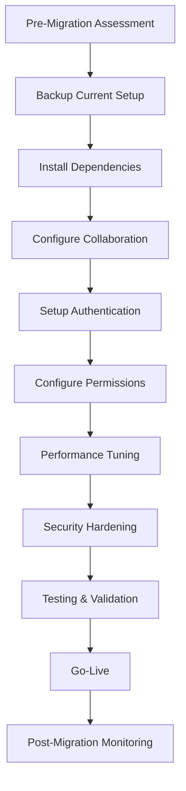

# Migrating to Collaborative Jupyter Notebook v7

This guide provides comprehensive instructions for transitioning from single-user to multi-user collaborative Jupyter Notebook v7 setups. The collaborative features are built on the Yjs CRDT (Conflict-free Replicated Data Type) framework, enabling real-time synchronization, user presence awareness, and automatic conflict resolution.

## Table of Contents

1. [Introduction](#introduction)
2. [Prerequisites](#prerequisites)
3. [Migration Process Overview](#migration-process-overview)
4. [Configuration Setup](#configuration-setup)
5. [JupyterHub Integration](#jupyterhub-integration)
6. [Permission Model Configuration](#permission-model-configuration)
7. [Performance Optimization](#performance-optimization)
8. [Security Considerations](#security-considerations)
9. [Troubleshooting](#troubleshooting)
10. [Rollback Procedures](#rollback-procedures)
11. [References](#references)

## Introduction

Jupyter Notebook v7 introduces groundbreaking real-time collaboration capabilities that transform the platform from a single-user application into a multi-user collaborative environment. The collaboration system includes:

### Key Collaborative Features

- **Real-time Document Synchronization**: Multiple users can simultaneously edit the same notebook with instant synchronization using Yjs CRDT technology
- **User Presence & Awareness**: Visual indicators show active collaborators with avatars, cursor positions, and selection highlights
- **Cell-Level Locking**: Distributed locking mechanism prevents editing conflicts while allowing concurrent work on different cells
- **Change History & Versioning**: Comprehensive version tracking with cell-level granularity and diff visualization
- **Permissions & Access Control**: Role-based access control (view-only, edit, admin) integrated with JupyterHub authentication
- **Comment & Review System**: Inline threaded comments with notification workflows and resolution tracking

### Architectural Principles

**Critical Design Principle**: All collaboration features are **OPTIONAL and DISABLED by default**, ensuring that legacy single-user workflows remain completely unaffected. Users must explicitly enable collaborative editing to activate these features.

The collaboration system maintains strict performance guarantees:
- **Edit Latency**: <100ms for typical editing operations
- **Memory Overhead**: ≤20% additional memory usage when enabled
- **Backward Compatibility**: Full compatibility with single-user scenarios when collaboration is disabled

## Prerequisites

Before migrating to collaborative Jupyter Notebook v7, ensure your system meets the following requirements:

### System Requirements

| Component | Minimum Version | Recommended Version | Notes |
|-----------|----------------|---------------------|-------|
| Python | 3.9+ | 3.11+ | Required for server components |
| Node.js | 18+ | 20+ | Required for build tools and frontend dependencies |
| Jupyter Server | 2.4.0+ | Latest | WebSocket support required |
| JupyterLab | 4.5.0+ | Latest | Component compatibility |

### Network Requirements

- **WebSocket Support**: Deployment environment must support WebSocket connections
- **Firewall Configuration**: WebSocket connections must be allowed through firewalls
- **Load Balancer**: Sticky sessions required if using load balancers
- **Connection Timeouts**: Configure appropriate WebSocket timeout settings

### Memory and Storage Requirements

- **Base Memory**: Standard Jupyter Notebook requirements
- **Additional Memory**: +20% when collaboration is enabled
- **Storage**: Persistent storage required for Yjs documents (filesystem, SQLite, or network storage)
- **Backup**: Backup strategy for collaborative document persistence

### Dependencies

The following additional dependencies are required for collaboration features:

```bash
# Core collaboration dependencies
yjs>=13.5.40
y-websocket>=1.5.0
y-protocols>=1.0.5
lib0>=0.2.42
```

### Environment Assessment

Before proceeding, assess your current environment:

1. **Single vs. Multi-user**: Determine if you're upgrading from single-user Jupyter or existing JupyterHub
2. **Authentication Method**: Identify current authentication mechanism (token, password, external)
3. **Network Topology**: Document load balancers, proxies, and firewall configurations
4. **Storage Architecture**: Assess current notebook storage and backup procedures
5. **User Base**: Estimate concurrent user load and collaboration requirements

## Migration Process Overview

The migration to collaborative Jupyter Notebook v7 follows a structured approach:

### Migration Phases



### Migration Timeline

| Phase | Duration | Activities | Stakeholders |
|-------|----------|------------|--------------|
| Planning | 1-2 weeks | Requirements analysis, environment assessment | IT, Users |
| Preparation | 1 week | Backup, dependency installation | IT |
| Configuration | 2-3 days | Collaboration setup, authentication | IT |
| Testing | 1 week | User acceptance testing, performance validation | IT, Users |
| Go-Live | 1 day | Production deployment, monitoring | IT |
| Post-Migration | 2 weeks | Issue resolution, optimization | IT, Users |

### Pre-Migration Checklist

Before beginning the migration:

- [ ] Complete environment assessment
- [ ] Backup all notebooks and configuration files
- [ ] Document current authentication and authorization setup
- [ ] Identify test users for validation
- [ ] Plan maintenance window for migration
- [ ] Prepare rollback procedures
- [ ] Notify users of planned changes

## Configuration Setup

This section details the configuration changes required to enable collaborative features.

### Basic Collaboration Configuration

#### Method 1: Command Line Flag

The simplest way to enable collaboration is using the `--collaborative` flag:

```bash
# Enable collaboration with single flag
jupyter notebook --collaborative

# With additional options
jupyter notebook --collaborative --port=8888 --ip=0.0.0.0
```

#### Method 2: Configuration File

For persistent configuration, add the following to your Jupyter configuration file:

**`~/.jupyter/jupyter_notebook_config.py`**:
```python
# Enable collaborative editing
c.NotebookApp.collaboration_enabled = True

# Optional: Configure collaboration server URL (defaults to current server)
c.NotebookApp.collaboration_server_url = "ws://localhost:8888"

# Optional: Configure Yjs document storage
c.NotebookApp.collaboration_storage_type = "filesystem"  # or "sqlite"
c.NotebookApp.collaboration_storage_path = "/path/to/collaboration/storage"
```

**`~/.jupyter/jupyter_server_config.d/collaboration.json`**:
```json
{
  "NotebookApp": {
    "collaboration_enabled": true,
    "collaboration_server_url": "ws://localhost:8888",
    "collaboration_storage_type": "filesystem"
  }
}
```

### WebSocket Endpoint Configuration

The collaboration system creates a dedicated WebSocket endpoint at `/api/collaboration/ws`. Configure your deployment to properly handle this endpoint:

#### Nginx Configuration

```nginx
server {
    listen 80;
    server_name your-notebook-server.com;

    # Standard HTTP proxy
    location / {
        proxy_pass http://localhost:8888;
        proxy_set_header Host $host;
        proxy_set_header X-Real-IP $remote_addr;
        proxy_set_header X-Forwarded-For $proxy_add_x_forwarded_for;
        proxy_set_header X-Forwarded-Proto $scheme;
    }

    # WebSocket proxy for collaboration
    location /api/collaboration/ws {
        proxy_pass http://localhost:8888;
        proxy_http_version 1.1;
        proxy_set_header Upgrade $http_upgrade;
        proxy_set_header Connection "Upgrade";
        proxy_set_header Host $host;
        proxy_set_header X-Real-IP $remote_addr;
        proxy_set_header X-Forwarded-For $proxy_add_x_forwarded_for;
        proxy_set_header X-Forwarded-Proto $scheme;

        # WebSocket specific timeouts
        proxy_read_timeout 86400;
        proxy_send_timeout 86400;
    }
}
```

#### Apache Configuration

```apache
<VirtualHost *:80>
    ServerName your-notebook-server.com

    # Standard HTTP proxy
    ProxyPreserveHost On
    ProxyPass /api/collaboration/ws ws://localhost:8888/api/collaboration/ws
    ProxyPassReverse /api/collaboration/ws ws://localhost:8888/api/collaboration/ws

    ProxyPass / http://localhost:8888/
    ProxyPassReverse / http://localhost:8888/

    # Enable WebSocket support
    RewriteEngine On
    RewriteCond %{HTTP:Upgrade} =websocket [NC]
    RewriteRule ^/api/collaboration/ws(.*) ws://localhost:8888/api/collaboration/ws$1 [P,L]
</VirtualHost>
```

### Yjs Document Storage Options

Configure how collaborative documents are stored:

#### Filesystem Storage (Default)

```python
# Simple file-based storage
c.NotebookApp.collaboration_storage_type = "filesystem"
c.NotebookApp.collaboration_storage_path = "/opt/jupyter/collaboration"

# With backup configuration
c.NotebookApp.collaboration_backup_enabled = True
c.NotebookApp.collaboration_backup_interval = 3600  # 1 hour
```

#### SQLite Storage

```python
# SQLite database storage
c.NotebookApp.collaboration_storage_type = "sqlite"
c.NotebookApp.collaboration_sqlite_path = "/opt/jupyter/collaboration.db"

# Performance tuning
c.NotebookApp.collaboration_sqlite_journal_mode = "WAL"
c.NotebookApp.collaboration_sqlite_synchronous = "NORMAL"
```

#### Network Storage (Redis)

For multi-server deployments:

```python
# Redis storage for scaling
c.NotebookApp.collaboration_storage_type = "redis"
c.NotebookApp.collaboration_redis_url = "redis://localhost:6379/0"

# Redis configuration
c.NotebookApp.collaboration_redis_key_prefix = "jupyter:collab:"
c.NotebookApp.collaboration_redis_ttl = 86400  # 24 hours
```

**Redis Installation**:
```bash
# Install Redis
sudo apt-get update
sudo apt-get install redis-server

# Configure Redis for collaboration
echo "maxmemory-policy allkeys-lru" >> /etc/redis/redis.conf
echo "save 900 1" >> /etc/redis/redis.conf
echo "save 300 10" >> /etc/redis/redis.conf

# Start Redis
sudo systemctl start redis-server
sudo systemctl enable redis-server
```

### HTTPS and Secure WebSockets

For production deployments, enable HTTPS and secure WebSockets:

```python
# HTTPS configuration
c.NotebookApp.certfile = '/path/to/ssl/cert.pem'
c.NotebookApp.keyfile = '/path/to/ssl/key.pem'

# Force secure WebSockets
c.NotebookApp.allow_insecure_websockets = False

# HSTS headers
c.NotebookApp.extra_headers = {
    'Strict-Transport-Security': 'max-age=31536000; includeSubDomains'
}
```

## JupyterHub Integration

For enterprise deployments using JupyterHub, the collaboration features integrate seamlessly with the existing authentication and authorization infrastructure.

### Authentication Handoff

The collaboration system inherits authentication from the parent JupyterHub session:

#### JupyterHub Configuration

**`jupyterhub_config.py`**:
```python
# Enable collaboration for all spawned notebooks
c.Spawner.args = ['--collaborative']

# Or configure via environment variables
c.Spawner.environment = {
    'JUPYTER_ENABLE_COLLABORATION': 'true'
}

# For containerized deployments
c.DockerSpawner.extra_create_kwargs = {
    'environment': ['JUPYTER_ENABLE_COLLABORATION=true']
}
```

#### Single-User Server Configuration

**`jupyter_server_config.py`**:
```python
# Collaboration configuration for JupyterHub spawned servers
import os

if os.environ.get('JUPYTERHUB_API_TOKEN'):
    # Running under JupyterHub
    c.NotebookApp.collaboration_enabled = True
    c.NotebookApp.collaboration_auth_provider = 'jupyterhub'

    # Use JupyterHub's authentication
    c.NotebookApp.collaboration_jupyterhub_api_url = os.environ.get('JUPYTERHUB_API_URL')
    c.NotebookApp.collaboration_jupyterhub_api_token = os.environ.get('JUPYTERHUB_API_TOKEN')
```

### OAuth Token Validation and Refresh

The collaboration system handles OAuth token validation automatically:

```python
# OAuth configuration
c.NotebookApp.collaboration_oauth_check_interval = 300  # 5 minutes
c.NotebookApp.collaboration_oauth_refresh_threshold = 600  # 10 minutes

# Token validation settings
c.NotebookApp.collaboration_token_validation_url = "{hub_api_url}/authorizations/token/{token}"
c.NotebookApp.collaboration_user_info_url = "{hub_api_url}/users/{username}"
```

### Permission Inheritance from JupyterHub Groups

Configure how JupyterHub groups map to collaboration roles:

```python
# Group to role mapping
c.NotebookApp.collaboration_group_mappings = {
    'instructors': 'admin',
    'teaching-assistants': 'edit',
    'students': 'view',
    'researchers': 'edit'
}

# Default role for users not in mapped groups
c.NotebookApp.collaboration_default_role = 'view'

# Admin groups (full collaboration management)
c.NotebookApp.collaboration_admin_groups = ['instructors', 'admin']
```

### Multi-Server Deployment

For scaled JupyterHub deployments:

#### Load Balancer Configuration

```yaml
# HAProxy configuration for sticky sessions
global
    daemon

defaults
    mode http
    timeout connect 5000ms
    timeout client 50000ms
    timeout server 50000ms

frontend jupyter_frontend
    bind *:80
    # Sticky sessions based on JupyterHub cookie
    stick-table type string len 64 size 100k expire 1h
    stick on cookie(jupyterhub-session-id)
    default_backend jupyter_backend

backend jupyter_backend
    balance roundrobin
    # WebSocket support
    option httpchk GET /hub/health
    server jupyter1 10.0.1.10:8000 check
    server jupyter2 10.0.1.11:8000 check
    server jupyter3 10.0.1.12:8000 check
```

#### Shared Storage Configuration

```python
# Shared Redis for multi-server collaboration
c.NotebookApp.collaboration_storage_type = "redis"
c.NotebookApp.collaboration_redis_url = "redis://redis-cluster:6379/0"
c.NotebookApp.collaboration_redis_cluster = True

# Shared filesystem (NFS/GlusterFS)
c.NotebookApp.collaboration_storage_type = "filesystem"
c.NotebookApp.collaboration_storage_path = "/shared/collaboration"
```

## Permission Model Configuration

The collaboration system implements role-based access control with three primary roles:

### Role Definitions

| Role | Permissions | Description |
|------|-------------|-------------|
| **view-only** | Connect, observe changes | Read-only access to collaborative sessions |
| **edit** | Connect, edit, comment | Full editing access including comments |
| **admin** | All permissions + management | Session management and role assignment |

### Setting Up Role-Based Access Control

#### PermissionManager Configuration

```python
# Enable permission management
c.NotebookApp.collaboration_permissions_enabled = True

# Permission storage backend
c.NotebookApp.collaboration_permissions_storage = "filesystem"  # or "database"
c.NotebookApp.collaboration_permissions_path = "/opt/jupyter/permissions"

# Default permissions for new documents
c.NotebookApp.collaboration_default_permissions = {
    'owner': 'admin',
    'authenticated_users': 'edit',
    'anonymous_users': 'view'
}
```

#### File-Level Permissions

Configure permissions at the notebook level:

**`.jupyter/collaboration_permissions.json`**:
```json
{
  "notebooks/research/experiment1.ipynb": {
    "alice@university.edu": "admin",
    "bob@university.edu": "edit",
    "students": "view"
  },
  "notebooks/teaching/lecture1.ipynb": {
    "instructors": "admin",
    "teaching-assistants": "edit",
    "students": "view"
  }
}
```

#### Dynamic Role Updates

Configure automatic role updates based on group membership:

```python
# Dynamic role assignment
c.NotebookApp.collaboration_dynamic_permissions = True
c.NotebookApp.collaboration_permission_sync_interval = 300  # 5 minutes

# Group synchronization
c.NotebookApp.collaboration_sync_jupyterhub_groups = True
c.NotebookApp.collaboration_group_api_url = "{hub_api_url}/groups"
```

### Permission Enforcement

#### API Level Enforcement

```python
# Enforce permissions at API level
c.NotebookApp.collaboration_enforce_permissions = True

# Permission check caching
c.NotebookApp.collaboration_permission_cache_ttl = 300  # 5 minutes
c.NotebookApp.collaboration_permission_cache_size = 1000
```

#### Cell-Level Locking

```python
# Lock configuration
c.NotebookApp.collaboration_locks_enabled = True
c.NotebookApp.collaboration_lock_timeout = 300  # 5 minutes
c.NotebookApp.collaboration_lock_heartbeat_interval = 30  # 30 seconds

# Lock override permissions
c.NotebookApp.collaboration_lock_override_roles = ['admin']
```

### UI Permission Controls

Enable permission management in the user interface:

```python
# Enable permission UI
c.NotebookApp.collaboration_permission_ui_enabled = True

# Allow role self-assignment for certain roles
c.NotebookApp.collaboration_self_assign_roles = ['view']

# Permission dialog settings
c.NotebookApp.collaboration_permission_dialog_timeout = 30  # seconds
```

## Performance Optimization

Optimize collaborative features for production workloads:

### WebSocket Connection Pooling

```python
# Connection pool settings
c.NotebookApp.collaboration_max_connections = 1000
c.NotebookApp.collaboration_connection_pool_size = 100
c.NotebookApp.collaboration_connection_timeout = 30

# Per-user connection limits
c.NotebookApp.collaboration_max_connections_per_user = 10
```

### Message Batching (50ms windows)

```python
# Message batching for performance
c.NotebookApp.collaboration_message_batching = True
c.NotebookApp.collaboration_batch_window_ms = 50  # 50ms windows
c.NotebookApp.collaboration_max_batch_size = 100

# Priority message handling
c.NotebookApp.collaboration_priority_messages = [
    'cursor_position',
    'selection_change',
    'user_presence'
]
```

### Memory Allocation Planning (20% overhead)

```python
# Memory management
c.NotebookApp.collaboration_memory_limit_mb = 512  # Per collaborative session
c.NotebookApp.collaboration_gc_interval = 300  # 5 minutes

# Document cleanup
c.NotebookApp.collaboration_inactive_document_timeout = 3600  # 1 hour
c.NotebookApp.collaboration_document_cleanup_interval = 1800  # 30 minutes
```

### Network Bandwidth Considerations

```python
# Bandwidth optimization
c.NotebookApp.collaboration_compression_enabled = True
c.NotebookApp.collaboration_compression_level = 6

# Update throttling
c.NotebookApp.collaboration_update_throttle_ms = 16  # ~60fps
c.NotebookApp.collaboration_presence_throttle_ms = 100  # 10fps for presence

# Delta compression
c.NotebookApp.collaboration_delta_compression = True
c.NotebookApp.collaboration_delta_threshold = 1024  # 1KB
```

### Performance Monitoring

```python
# Enable performance metrics
c.NotebookApp.collaboration_metrics_enabled = True
c.NotebookApp.collaboration_metrics_interval = 60  # 1 minute

# Metrics to collect
c.NotebookApp.collaboration_metrics_include = [
    'connection_count',
    'message_rate',
    'memory_usage',
    'latency_percentiles'
]

# Performance alerts
c.NotebookApp.collaboration_alert_latency_threshold_ms = 200
c.NotebookApp.collaboration_alert_memory_threshold_mb = 1024
```

### Scaling Configuration

For high-load deployments:

#### Horizontal Scaling

```python
# Multi-server setup
c.NotebookApp.collaboration_cluster_mode = True
c.NotebookApp.collaboration_cluster_nodes = [
    'notebook1.cluster:8888',
    'notebook2.cluster:8888',
    'notebook3.cluster:8888'
]

# Load balancing
c.NotebookApp.collaboration_load_balance_strategy = 'round_robin'  # or 'least_connections'
```

#### Vertical Scaling

```python
# Resource allocation
c.NotebookApp.collaboration_worker_threads = 4
c.NotebookApp.collaboration_worker_queue_size = 1000
c.NotebookApp.collaboration_async_workers = 8

# CPU optimization
c.NotebookApp.collaboration_cpu_affinity = [0, 1, 2, 3]  # Bind to specific cores
```

## Security Considerations

Implement comprehensive security measures for collaborative deployments:

### WebSocket Authentication Setup

```python
# Authentication configuration
c.NotebookApp.collaboration_auth_required = True
c.NotebookApp.collaboration_auth_timeout = 30  # seconds

# Token validation
c.NotebookApp.collaboration_validate_tokens = True
c.NotebookApp.collaboration_token_refresh_interval = 3600  # 1 hour
```

### Cell-Level Lock Security

```python
# Lock security settings
c.NotebookApp.collaboration_secure_locks = True
c.NotebookApp.collaboration_lock_encryption = True
c.NotebookApp.collaboration_lock_signature_key = "your-secret-key"

# Lock hijacking prevention
c.NotebookApp.collaboration_prevent_lock_hijacking = True
c.NotebookApp.collaboration_lock_validation_interval = 60
```

### User Presence Data Protection

```python
# Privacy settings
c.NotebookApp.collaboration_anonymize_presence = False
c.NotebookApp.collaboration_presence_data_retention = 86400  # 24 hours

# Data minimization
c.NotebookApp.collaboration_minimal_presence_data = True
c.NotebookApp.collaboration_exclude_sensitive_info = True
```

### Audit Logging for Collaborative Operations

```python
# Comprehensive audit logging
c.NotebookApp.collaboration_audit_enabled = True
c.NotebookApp.collaboration_audit_level = 'INFO'
c.NotebookApp.collaboration_audit_file = '/var/log/jupyter/collaboration.log'

# Event tracking
c.NotebookApp.collaboration_audit_events = [
    'user_connect',
    'user_disconnect',
    'document_edit',
    'permission_change',
    'lock_acquire',
    'lock_release'
]

# Log rotation
c.NotebookApp.collaboration_audit_log_rotation = True
c.NotebookApp.collaboration_audit_max_size_mb = 100
c.NotebookApp.collaboration_audit_backup_count = 10
```

### SIEM Integration

```python
# SIEM integration
c.NotebookApp.collaboration_siem_enabled = True
c.NotebookApp.collaboration_siem_endpoint = 'https://siem.company.com/api/events'
c.NotebookApp.collaboration_siem_format = 'json'  # or 'syslog'

# Authentication for SIEM
c.NotebookApp.collaboration_siem_auth_token = 'your-siem-token'
c.NotebookApp.collaboration_siem_batch_size = 100
```

### Security Hardening

#### WebSocket Security Controls

```python
# Rate limiting
c.NotebookApp.collaboration_rate_limit_enabled = True
c.NotebookApp.collaboration_rate_limit_per_minute = 1000
c.NotebookApp.collaboration_rate_limit_burst = 100

# Message size limits
c.NotebookApp.collaboration_max_message_size_kb = 1024  # 1MB
c.NotebookApp.collaboration_max_document_size_mb = 100   # 100MB

# Connection limits
c.NotebookApp.collaboration_max_concurrent_connections = 500
c.NotebookApp.collaboration_connection_queue_size = 100
```

#### Content Security Policy

```python
# CSP for collaborative features
c.NotebookApp.collaboration_csp_policy = {
    'default-src': "'self'",
    'connect-src': "'self' wss: ws:",
    'script-src': "'self' 'unsafe-inline' 'unsafe-eval'",
    'style-src': "'self' 'unsafe-inline'"
}
```

#### Input Validation

```python
# Strict input validation
c.NotebookApp.collaboration_validate_cell_content = True
c.NotebookApp.collaboration_sanitize_inputs = True
c.NotebookApp.collaboration_blocked_content_types = [
    'application/x-executable',
    'application/x-shockwave-flash'
]
```

## Troubleshooting

Common issues and solutions when migrating to collaborative Jupyter Notebook:

### Connection Issues

#### WebSocket Connection Failures

**Symptoms**:
- Users cannot join collaborative sessions
- "WebSocket connection failed" errors
- Intermittent connectivity issues

**Diagnosis**:
```bash
# Check WebSocket endpoint
curl -i -N -H "Connection: Upgrade" -H "Upgrade: websocket" \
  -H "Sec-WebSocket-Key: test" -H "Sec-WebSocket-Version: 13" \
  http://your-server:8888/api/collaboration/ws

# Check server logs
tail -f /var/log/jupyter/jupyter.log | grep -i websocket
```

**Solutions**:
```python
# Configuration fixes
c.NotebookApp.allow_insecure_websockets = True  # For testing only
c.NotebookApp.collaboration_websocket_timeout = 60
c.NotebookApp.collaboration_connection_retry_attempts = 3
```

#### Load Balancer Configuration Issues

**Symptoms**:
- Users lose connection when switching servers
- Collaborative sessions break randomly

**Solutions**:
```nginx
# Nginx sticky sessions
upstream jupyter_backend {
    ip_hash;  # Simple sticky sessions
    server notebook1:8888;
    server notebook2:8888;
}

# Or use more sophisticated session affinity
map $cookie_jupyterhub-session-id $backend_pool {
    default notebook1:8888;
    ~.{32}1$ notebook1:8888;
    ~.{32}2$ notebook2:8888;
}
```

### Performance Issues

#### High Latency in Collaborative Editing

**Symptoms**:
- Slow response time (>100ms) for edits
- Users complaining about lag
- High CPU usage on server

**Diagnosis**:
```bash
# Monitor server performance
top -p $(pgrep -f jupyter-notebook)

# Check network latency
ping -c 10 your-server.com

# Monitor WebSocket metrics
ss -tuln | grep :8888
```

**Solutions**:
```python
# Performance tuning
c.NotebookApp.collaboration_message_batching = True
c.NotebookApp.collaboration_batch_window_ms = 25  # Reduce batch window
c.NotebookApp.collaboration_worker_threads = 8    # Increase workers

# Enable compression
c.NotebookApp.collaboration_compression_enabled = True
c.NotebookApp.collaboration_compression_level = 4  # Balance speed/compression
```

#### Memory Usage Issues

**Symptoms**:
- Server running out of memory
- Collaborative sessions being terminated
- Slow garbage collection

**Diagnosis**:
```bash
# Monitor memory usage
free -h
ps -p $(pgrep -f jupyter-notebook) -o pid,vsz,rss,pmem

# Check collaboration memory usage
jupyter notebook --debug --log-level=DEBUG 2>&1 | grep -i memory
```

**Solutions**:
```python
# Memory optimization
c.NotebookApp.collaboration_memory_limit_mb = 256  # Per session
c.NotebookApp.collaboration_gc_interval = 180      # More frequent GC
c.NotebookApp.collaboration_inactive_document_timeout = 1800  # 30 minutes

# Document cleanup
c.NotebookApp.collaboration_max_document_history = 100
c.NotebookApp.collaboration_compress_old_versions = True
```

### Authentication and Authorization Issues

#### JupyterHub Integration Problems

**Symptoms**:
- Users cannot authenticate to collaborative sessions
- Permission errors in collaborative mode
- Token validation failures

**Diagnosis**:
```bash
# Check JupyterHub API connectivity
curl -H "Authorization: token $JUPYTERHUB_API_TOKEN" \
  $JUPYTERHUB_API_URL/users

# Verify environment variables
env | grep JUPYTERHUB
```

**Solutions**:
```python
# Fix authentication
c.NotebookApp.collaboration_auth_provider = 'jupyterhub'
c.NotebookApp.collaboration_jupyterhub_api_url = os.environ.get('JUPYTERHUB_API_URL')
c.NotebookApp.collaboration_debug_auth = True  # Enable for debugging

# Increase token validation timeout
c.NotebookApp.collaboration_token_validation_timeout = 10
```

#### Permission Denied Errors

**Symptoms**:
- Users with appropriate roles cannot edit
- Permission checks failing
- Inconsistent access rights

**Diagnosis**:
```python
# Enable debug logging for permissions
c.NotebookApp.collaboration_debug_permissions = True
c.NotebookApp.log_level = 'DEBUG'
```

**Solutions**:
```python
# Reset permissions
c.NotebookApp.collaboration_reset_permissions_on_start = True

# Simplify permission model for testing
c.NotebookApp.collaboration_default_permissions = {
    'authenticated_users': 'edit'
}

# Force permission refresh
c.NotebookApp.collaboration_permission_cache_ttl = 0  # Disable caching
```

### Data Synchronization Issues

#### Yjs Document Corruption

**Symptoms**:
- Notebooks showing incorrect content
- Synchronization failures
- Version conflicts

**Diagnosis**:
```bash
# Check Yjs document storage
ls -la /path/to/collaboration/storage/
file /path/to/collaboration/storage/*

# Validate document integrity
python -c "
import yjs
doc = yjs.YDoc()
with open('path/to/document.yjs', 'rb') as f:
    doc.apply_update(f.read())
print('Document valid')
"
```

**Solutions**:
```python
# Document recovery
c.NotebookApp.collaboration_document_backup_enabled = True
c.NotebookApp.collaboration_document_backup_interval = 300

# Automatic repair
c.NotebookApp.collaboration_auto_repair_documents = True
c.NotebookApp.collaboration_repair_on_conflict = True

# Fallback to filesystem backup
c.NotebookApp.collaboration_fallback_to_file = True
```

### Debugging Tools

#### Enable Comprehensive Logging

```python
# Debug configuration
c.NotebookApp.log_level = 'DEBUG'
c.NotebookApp.collaboration_debug_enabled = True
c.NotebookApp.collaboration_debug_websockets = True
c.NotebookApp.collaboration_debug_yjs = True

# Separate log files
c.NotebookApp.collaboration_log_file = '/var/log/jupyter/collaboration.log'
c.NotebookApp.collaboration_websocket_log_file = '/var/log/jupyter/websockets.log'
```

#### Performance Profiling

```bash
# Profile server performance
python -m cProfile -o collaboration_profile.prof \
  $(which jupyter-notebook) --collaborative

# Analyze profile
python -c "
import pstats
p = pstats.Stats('collaboration_profile.prof')
p.sort_stats('cumulative').print_stats(20)
"
```

#### Health Check Endpoints

```python
# Enable health checks
c.NotebookApp.collaboration_health_check_enabled = True
c.NotebookApp.collaboration_health_check_endpoint = '/health/collaboration'

# Custom health checks
c.NotebookApp.collaboration_custom_health_checks = [
    'websocket_connectivity',
    'yjs_document_integrity',
    'permission_system_status'
]
```

### Log Analysis

Common log patterns and their meanings:

```bash
# Connection successful
grep "WebSocket connection established" /var/log/jupyter/collaboration.log

# Authentication issues
grep "Authentication failed" /var/log/jupyter/collaboration.log

# Performance warnings
grep "High latency detected" /var/log/jupyter/collaboration.log

# Document synchronization
grep "Yjs update applied" /var/log/jupyter/collaboration.log
```

## Rollback Procedures

If issues occur during or after migration, use these procedures to rollback to single-user mode:

### Immediate Rollback

#### Disable Collaboration (Quick)

```bash
# Method 1: Stop collaborative server and restart without flag
pkill -f "jupyter-notebook.*--collaborative"
jupyter notebook  # Start without --collaborative flag

# Method 2: Disable via environment variable
export JUPYTER_DISABLE_COLLABORATION=true
systemctl restart jupyter-notebook
```

#### Configuration Rollback

```python
# Temporarily disable in config file
c.NotebookApp.collaboration_enabled = False

# Or comment out collaboration settings
# c.NotebookApp.collaboration_enabled = True
# c.NotebookApp.collaboration_storage_type = "filesystem"
```

### Data Preservation During Rollback

#### Export Collaborative Documents

```bash
#!/bin/bash
# Export script for collaborative documents

COLLAB_DIR="/path/to/collaboration/storage"
BACKUP_DIR="/path/to/rollback/backup"

mkdir -p "$BACKUP_DIR"

# Export Yjs documents to standard notebook format
for doc in "$COLLAB_DIR"/*.yjs; do
    if [ -f "$doc" ]; then
        notebook_name=$(basename "$doc" .yjs).ipynb
        python3 << EOF
import yjs
import json

# Load Yjs document
doc = yjs.YDoc()
with open('$doc', 'rb') as f:
    doc.apply_update(f.read())

# Extract notebook content
notebook_data = doc.get_map('notebook')
cells = notebook_data.get_array('cells')

# Convert to standard notebook format
notebook = {
    'nbformat': 4,
    'nbformat_minor': 4,
    'metadata': {},
    'cells': [cell.to_json() for cell in cells]
}

# Save as standard notebook
with open('$BACKUP_DIR/$notebook_name', 'w') as f:
    json.dump(notebook, f, indent=2)

print(f"Exported {notebook_name}")
EOF
    fi
done

echo "Export complete. Files saved to $BACKUP_DIR"
```

#### Version History Preservation

```python
# Script to preserve version history
import json
import os
from datetime import datetime

def export_version_history(collab_dir, output_dir):
    """Export collaboration version history to JSON files."""

    os.makedirs(output_dir, exist_ok=True)

    for filename in os.listdir(collab_dir):
        if filename.endswith('.yjs'):
            notebook_name = filename.replace('.yjs', '')
            history_file = os.path.join(collab_dir, f"{notebook_name}_history.json")

            if os.path.exists(history_file):
                # Copy history file to backup location
                output_file = os.path.join(output_dir, f"{notebook_name}_history.json")
                with open(history_file, 'r') as src, open(output_file, 'w') as dst:
                    history_data = json.load(src)
                    # Add export metadata
                    history_data['export_info'] = {
                        'exported_at': datetime.now().isoformat(),
                        'original_file': filename,
                        'rollback_reason': 'Migration rollback'
                    }
                    json.dump(history_data, dst, indent=2)

                print(f"Exported history for {notebook_name}")

# Usage
export_version_history("/path/to/collaboration/storage", "/path/to/history/backup")
```

### Clean Rollback Process

#### Full Environment Rollback

```bash
#!/bin/bash
# Complete rollback script

echo "Starting Jupyter Notebook collaboration rollback..."

# 1. Stop collaborative services
echo "Stopping collaborative services..."
systemctl stop jupyter-notebook
pkill -f "jupyter-notebook.*--collaborative"

# 2. Backup collaboration data
echo "Backing up collaboration data..."
TIMESTAMP=$(date +%Y%m%d_%H%M%S)
BACKUP_DIR="/opt/jupyter/rollback_backup_$TIMESTAMP"
mkdir -p "$BACKUP_DIR"

# Backup configuration
cp -r ~/.jupyter "$BACKUP_DIR/jupyter_config"

# Backup collaboration storage
if [ -d "/opt/jupyter/collaboration" ]; then
    cp -r /opt/jupyter/collaboration "$BACKUP_DIR/collaboration_data"
fi

# 3. Restore original configuration
echo "Restoring original configuration..."
if [ -f ~/.jupyter/jupyter_notebook_config.py.pre_collaboration ]; then
    cp ~/.jupyter/jupyter_notebook_config.py.pre_collaboration ~/.jupyter/jupyter_notebook_config.py
else
    # Create minimal single-user config
    cat > ~/.jupyter/jupyter_notebook_config.py << 'EOF'
# Jupyter Notebook configuration (single-user mode)
c.NotebookApp.ip = '0.0.0.0'
c.NotebookApp.port = 8888
c.NotebookApp.open_browser = False

# Disable collaboration features
c.NotebookApp.collaboration_enabled = False
EOF
fi

# 4. Clean up collaboration dependencies (optional)
echo "Cleaning up collaboration dependencies..."
pip uninstall -y yjs y-websocket y-protocols lib0

# 5. Restart in single-user mode
echo "Restarting Jupyter Notebook in single-user mode..."
systemctl start jupyter-notebook

# 6. Verify rollback
sleep 5
if pgrep -f jupyter-notebook > /dev/null; then
    echo "✅ Rollback successful. Jupyter Notebook running in single-user mode."
    echo "📁 Collaboration data backed up to: $BACKUP_DIR"
    echo "🔗 Access notebook at: http://localhost:8888"
else
    echo "❌ Rollback failed. Check logs: journalctl -u jupyter-notebook"
    exit 1
fi

echo "Rollback complete!"
```

### Partial Rollback Options

#### Disable Collaboration but Keep Dependencies

```python
# Keep collaboration code but disable features
c.NotebookApp.collaboration_enabled = False
c.NotebookApp.collaboration_ui_hidden = True

# Preserve data for future re-enabling
c.NotebookApp.collaboration_preserve_data = True
c.NotebookApp.collaboration_readonly_mode = True
```

#### Selective Feature Rollback

```python
# Disable specific collaboration features
c.NotebookApp.collaboration_enabled = True
c.NotebookApp.collaboration_realtime_sync = False     # Disable real-time sync
c.NotebookApp.collaboration_user_presence = False    # Disable presence
c.NotebookApp.collaboration_cell_locking = False     # Disable locking
c.NotebookApp.collaboration_version_history = False  # Disable history

# Keep only basic collaboration
c.NotebookApp.collaboration_comments_only = True
```

### Rollback Validation

#### Post-Rollback Checklist

- [ ] Jupyter Notebook starts successfully
- [ ] All notebooks open correctly
- [ ] Cell execution works normally
- [ ] No collaboration UI elements visible
- [ ] Performance restored to pre-migration levels
- [ ] All users can access their notebooks
- [ ] Backup data preserved and accessible

#### Testing Single-User Functionality

```bash
# Test script for post-rollback validation
#!/bin/bash

echo "Testing post-rollback functionality..."

# Test 1: Server startup
if curl -s http://localhost:8888 | grep -q "Jupyter"; then
    echo "✅ Server accessible"
else
    echo "❌ Server not accessible"
    exit 1
fi

# Test 2: Notebook operations
python3 << 'EOF'
import requests
import json

# Test notebook creation
create_response = requests.post('http://localhost:8888/api/contents/test_rollback.ipynb',
    json={
        'type': 'notebook',
        'content': {
            'nbformat': 4,
            'nbformat_minor': 4,
            'metadata': {},
            'cells': []
        }
    })

if create_response.status_code == 201:
    print("✅ Notebook creation works")
else:
    print("❌ Notebook creation failed")

# Clean up
requests.delete('http://localhost:8888/api/contents/test_rollback.ipynb')
EOF

# Test 3: No collaboration endpoints
if curl -s http://localhost:8888/api/collaboration/ws | grep -q "404"; then
    echo "✅ Collaboration endpoints properly disabled"
else
    echo "⚠️  Collaboration endpoints still accessible"
fi

echo "Rollback validation complete!"
```

## References

### Related Documentation

- [Collaboration Features Guide](../collaboration/index.md) - Comprehensive guide to using collaborative features
- [JupyterHub Integration](../jupyterhub/collaboration.md) - Detailed JupyterHub setup instructions
- [Security Configuration](../security/collaboration.md) - Security best practices for collaborative deployments
- [Performance Tuning](../performance/collaboration.md) - Advanced performance optimization techniques
- [API Documentation](../api/collaboration.md) - Collaboration API reference

### External Resources

- [Yjs Documentation](https://docs.yjs.dev/) - Official Yjs CRDT framework documentation
- [JupyterHub Documentation](https://jupyterhub.readthedocs.io/) - Complete JupyterHub administration guide
- [Jupyter Server Documentation](https://jupyter-server.readthedocs.io/) - Server configuration and customization
- [WebSocket Protocol RFC](https://tools.ietf.org/html/rfc6455) - WebSocket protocol specification

### Community Support

- [Jupyter Community Forum](https://discourse.jupyter.org/) - Community discussions and support
- [GitHub Issues](https://github.com/jupyter/notebook/issues) - Bug reports and feature requests
- [Jupyter Mailing List](https://groups.google.com/forum/#!forum/jupyter) - Developer and user discussions
- [Stack Overflow](https://stackoverflow.com/questions/tagged/jupyter-notebook) - Technical Q&A

### Migration Support

For organizations requiring professional migration support:

- **Consultation Services**: Professional assessment and migration planning
- **Training Programs**: User and administrator training for collaborative features
- **Custom Integration**: Tailored integration with enterprise systems
- **Ongoing Support**: Post-migration monitoring and optimization

Contact the Jupyter project maintainers or your organization's Jupyter support team for assistance with complex migration scenarios.

---

**Note**: This migration guide is part of the Jupyter Notebook v7 documentation. For the most up-to-date information and troubleshooting resources, refer to the official Jupyter documentation and community resources.
