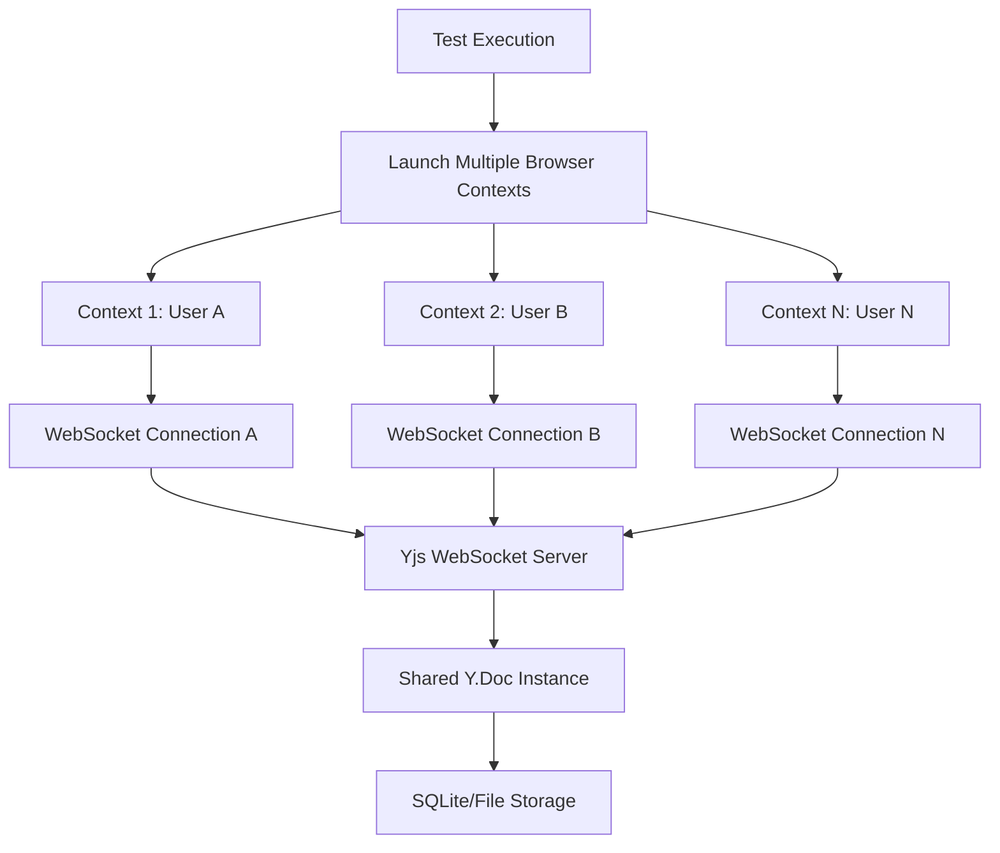
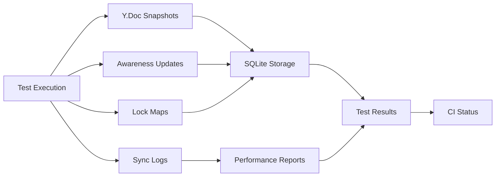

# Collaboration Testing Guide

This comprehensive guide covers testing and validation of Jupyter Notebook v7's real-time collaborative editing capabilities, including setup instructions, test scenarios, performance benchmarking, and troubleshooting guidance.

## Table of Contents

1. [Overview](#overview)
2. [Prerequisites and Setup](#prerequisites-and-setup)
3. [Test Architecture](#test-architecture)
4. [Running Collaboration Tests](#running-collaboration-tests)
5. [Test Scenarios](#test-scenarios)
6. [Performance Benchmarking](#performance-benchmarking)
7. [Test Configuration Options](#test-configuration-options)
8. [Troubleshooting](#troubleshooting)
9. [CI/CD Integration](#cicd-integration)
10. [Interpreting Results](#interpreting-results)
11. [Best Practices](#best-practices)

## Overview

### Testing Goals

The collaboration testing framework validates six core collaborative features:

- **Real-Time Document Synchronization (F-024)**: Bidirectional sync using Yjs CRDT framework
- **User Presence & Awareness (F-025)**: User avatars, cursor positions, and activity indicators
- **Cell-Level Locking (F-026)**: Distributed locking mechanism preventing simultaneous edits
- **Change History & Versioning (F-027)**: Version tracking with cell-level granularity
- **Permissions & Access Control (F-028)**: Role-based access control integrated with JupyterHub
- **Comment & Review System (F-029)**: Collaborative review workflows with notifications

### Architecture Components

The collaborative testing infrastructure consists of:

```
┌─────────────────────────────────────────────────────────────────┐
│                    Collaboration Test Suite                     │
├─────────────────────────────────────────────────────────────────┤
│ Multi-Browser Client Simulation (Playwright Contexts)          │
├─────────────────────────────────────────────────────────────────┤
│ Yjs WebSocket Server (Tornado/Python Backend)                  │
├─────────────────────────────────────────────────────────────────┤
│ Optional Redis Clustering (Multi-server Testing)               │
├─────────────────────────────────────────────────────────────────┤
│ SQLite/File-based Persistence (Document Storage)               │
└─────────────────────────────────────────────────────────────────┘
```

## Prerequisites and Setup

### System Requirements

- Node.js 18+ for frontend testing
- Python 3.9+ for backend components
- WebSocket-capable environment
- Minimum 8GB RAM for multi-user simulation
- Docker (optional, for isolated testing)

### Local Development Setup

1. **Install Dependencies**:
   ```bash
   # Install development dependencies
   jlpm install

   # Install collaboration-specific testing packages
   pip install -e .[test,collaboration]
   ```

2. **Enable Collaboration Mode**:
   ```bash
   # Set collaboration flag in config
   echo "c.NotebookApp.collaboration_enabled = True" >> jupyter_notebook_config.py

   # Or use command-line flag
   jupyter notebook --collaborative
   ```

3. **Verify WebSocket Support**:
   ```bash
   # Test WebSocket connectivity
   curl -i -N -H "Connection: Upgrade" \
        -H "Upgrade: websocket" \
        -H "Host: localhost:8888" \
        -H "Origin: http://localhost:8888" \
        http://localhost:8888/api/collaboration/ws
   ```

### Docker-based Setup (Recommended)

```dockerfile
# Use provided test environment
docker build -t jupyter-collab-test -f Dockerfile.collab-test .
docker run -p 8888:8888 -p 3000:3000 jupyter-collab-test
```

## Test Architecture

### Multi-User Simulation Strategy

The testing framework uses multiple Playwright browser contexts to simulate concurrent users:



### Test Data Flow



## Running Collaboration Tests

### Command-Line Interface

```bash
# Run all collaboration tests
jlpm test:collaboration

# Run specific test suites
jlpm test:collab:unit          # Unit tests only
jlpm test:collab:integration   # Integration tests
jlpm test:collab:e2e          # End-to-end tests
jlpm test:collab:performance  # Performance benchmarks

# Run with specific scenarios
jlpm test:collab --scenario=dual-user
jlpm test:collab --scenario=multi-user
jlpm test:collab --scenario=stress-test
```

### Python Test Execution

```bash
# Run collaboration integration tests
python -m pytest tests/collaboration/ -v

# Run WebSocket handler tests
python -m pytest tests/collaboration/test_yjs_handler.py

# Run with coverage
python -m pytest tests/collaboration/ --cov=notebook.collab --cov-report=html
```

### Combined Test Execution

```bash
# Run full collaboration test suite
make test-collaboration

# Or using npm script
npm run test:collaboration:full
```

## Test Scenarios

### Dual-User Scenarios

Tests involving exactly two concurrent users:

#### Scenario: Sequential Cell Editing
```typescript
test('sequential cell editing should sync correctly', async ({ browser }) => {
  const [page1, page2] = await createDualUserSession(browser);

  // User 1 edits first cell
  await page1.click('.jp-Cell:first-child .CodeMirror');
  await page1.keyboard.type('print("User 1 edit")');

  // Verify User 2 sees the change
  await page2.waitForFunction(() =>
    document.querySelector('.jp-Cell:first-child .CodeMirror-line')
      ?.textContent?.includes('User 1 edit')
  );

  // User 2 edits second cell
  await page2.keyboard.press('Escape');
  await page2.keyboard.press('b'); // Insert cell below
  await page2.keyboard.type('print("User 2 edit")');

  // Verify User 1 sees User 2's cell
  await page1.waitForSelector('.jp-Cell:nth-child(2)');
  const cellCount = await page1.locator('.jp-Cell').count();
  expect(cellCount).toBe(2);
});
```

#### Scenario: Cell Lock Acquisition
```typescript
test('cell locking should prevent simultaneous edits', async ({ browser }) => {
  const [page1, page2] = await createDualUserSession(browser);

  // User 1 starts editing first cell
  await page1.click('.jp-Cell:first-child .CodeMirror');

  // Verify lock indicator appears
  await page1.waitForSelector('.jp-Cell:first-child .jp-collab-lock-indicator');

  // User 2 should see the lock and be prevented from editing
  await page2.click('.jp-Cell:first-child .CodeMirror');
  const lockVisible = await page2.isVisible('.jp-Cell:first-child .jp-collab-lock-indicator');
  expect(lockVisible).toBe(true);

  // Verify User 2 cannot edit
  await page2.keyboard.type('attempted edit');

  // Cell content should remain unchanged by User 2
  const cellContent = await page1.textContent('.jp-Cell:first-child .CodeMirror-line');
  expect(cellContent).not.toContain('attempted edit');
});
```

### Multi-User Scenarios (3+ Users)

Tests involving three or more concurrent users:

#### Scenario: Multi-User Presence
```typescript
test('presence indicators should show all active users', async ({ browser }) => {
  const pages = await createMultiUserSession(browser, 4); // 4 users

  // All users should see presence indicators for others
  for (let i = 0; i < pages.length; i++) {
    const avatarCount = await pages[i].locator('.jp-collaboration-avatar').count();
    expect(avatarCount).toBeGreaterThanOrEqual(3); // Should see 3 other users
  }

  // Test cursor tracking across users
  await pages[0].click('.jp-Cell:first-child .CodeMirror');

  // Other users should see cursor overlay
  for (let i = 1; i < pages.length; i++) {
    await pages[i].waitForSelector('.jp-collab-cursor-overlay');
  }
});
```

#### Scenario: Concurrent Cell Creation
```typescript
test('concurrent cell creation should maintain consistency', async ({ browser }) => {
  const pages = await createMultiUserSession(browser, 3);

  // All users simultaneously create cells
  await Promise.all(pages.map(async (page, index) => {
    await page.keyboard.press('b'); // Insert cell below
    await page.keyboard.type(`print("Cell from User ${index + 1}")`);
  }));

  // Wait for synchronization
  await new Promise(resolve => setTimeout(resolve, 1000));

  // All users should see the same final state
  const cellCounts = await Promise.all(
    pages.map(page => page.locator('.jp-Cell').count())
  );

  // All counts should be equal
  const expectedCount = cellCounts[0];
  cellCounts.forEach(count => expect(count).toBe(expectedCount));
});
```

### Stress Test Scenarios

High-load testing with intensive operations:

#### Scenario: High-Frequency Edits
```typescript
test('high-frequency edits should maintain performance', async ({ browser }) => {
  const pages = await createMultiUserSession(browser, 5);

  const startTime = Date.now();

  // Each user performs rapid edits for 30 seconds
  const editPromises = pages.map(async (page, userIndex) => {
    const endTime = startTime + 30000; // 30 seconds
    let editCount = 0;

    while (Date.now() < endTime) {
      await page.click('.jp-Cell:first-child .CodeMirror');
      await page.keyboard.type(`Edit ${editCount++} from User ${userIndex} `);
      await new Promise(resolve => setTimeout(resolve, 100)); // 10 edits/second
    }

    return editCount;
  });

  const editCounts = await Promise.all(editPromises);
  const totalEdits = editCounts.reduce((sum, count) => sum + count, 0);

  console.log(`Completed ${totalEdits} total edits across ${pages.length} users`);

  // Verify final state consistency
  await verifyDocumentConsistency(pages);

  // Performance assertions
  expect(totalEdits).toBeGreaterThan(1000); // Should handle significant load
});
```

### Error Recovery Scenarios

Tests for handling various failure conditions:

#### Scenario: WebSocket Disconnection
```typescript
test('should recover from WebSocket disconnection', async ({ browser }) => {
  const [page1, page2] = await createDualUserSession(browser);

  // Simulate network interruption for User 1
  await page1.evaluate(() => {
    window.collaborationProvider.disconnect();
  });

  // User 2 continues editing
  await page2.click('.jp-Cell:first-child .CodeMirror');
  await page2.keyboard.type('Edit during disconnection');

  // Reconnect User 1
  await page1.evaluate(() => {
    window.collaborationProvider.connect();
  });

  // Verify User 1 receives missed changes
  await page1.waitForFunction(() =>
    document.querySelector('.jp-Cell:first-child .CodeMirror-line')
      ?.textContent?.includes('Edit during disconnection')
  );
});
```

## Performance Benchmarking

### Latency Measurement

```typescript
// Example latency benchmark test
test('edit latency should be under 100ms', async ({ browser }) => {
  const [page1, page2] = await createDualUserSession(browser);

  const latencies = [];

  for (let i = 0; i < 50; i++) {
    const startTime = performance.now();

    // User 1 makes an edit
    await page1.click('.jp-Cell:first-child .CodeMirror');
    await page1.keyboard.type(`test-${i}`);

    // Wait for User 2 to see the change
    await page2.waitForFunction(
      (testIndex) => document.querySelector('.jp-Cell:first-child .CodeMirror-line')
        ?.textContent?.includes(`test-${testIndex}`),
      i
    );

    const endTime = performance.now();
    latencies.push(endTime - startTime);

    // Clear for next iteration
    await page1.keyboard.selectAll();
    await page1.keyboard.press('Delete');
  }

  // Calculate statistics
  const avgLatency = latencies.reduce((sum, lat) => sum + lat, 0) / latencies.length;
  const p95Latency = latencies.sort((a, b) => a - b)[Math.floor(latencies.length * 0.95)];

  console.log(`Average latency: ${avgLatency.toFixed(2)}ms`);
  console.log(`95th percentile latency: ${p95Latency.toFixed(2)}ms`);

  // Performance assertions
  expect(p95Latency).toBeLessThan(100); // 95th percentile under 100ms
  expect(avgLatency).toBeLessThan(50);  // Average under 50ms
});
```

### Memory Usage Monitoring

```bash
# Script to monitor memory usage during collaboration tests
#!/bin/bash

# Start memory monitoring
echo "Monitoring memory usage during collaboration tests..."

# Baseline memory usage
baseline_memory=$(ps -o rss= -p $notebook_pid | awk '{print $1}')
echo "Baseline memory: ${baseline_memory}KB"

# Run collaboration tests
jlpm test:collab:performance &
test_pid=$!

# Monitor memory during tests
max_memory=0
while kill -0 $test_pid 2>/dev/null; do
    current_memory=$(ps -o rss= -p $notebook_pid | awk '{print $1}')
    if [ $current_memory -gt $max_memory ]; then
        max_memory=$current_memory
    fi
    sleep 1
done

# Calculate memory overhead
overhead_percent=$(echo "scale=2; ($max_memory - $baseline_memory) * 100 / $baseline_memory" | bc)

echo "Peak memory: ${max_memory}KB"
echo "Memory overhead: ${overhead_percent}%"

# Assert memory overhead is under 20%
if (( $(echo "$overhead_percent > 20" | bc -l) )); then
    echo "ERROR: Memory overhead exceeds 20% threshold"
    exit 1
fi
```

### Throughput Testing

```python
# Python script for measuring collaborative throughput
import asyncio
import websockets
import json
import time
from concurrent.futures import ThreadPoolExecutor

async def simulate_collaborative_client(client_id, duration_seconds=60):
    """Simulate a single collaborative client making continuous edits."""
    uri = "ws://localhost:8888/api/collaboration/ws?path=test.ipynb"
    edit_count = 0

    async with websockets.connect(uri) as websocket:
        # Perform edits for specified duration
        start_time = time.time()

        while time.time() - start_time < duration_seconds:
            # Send edit operation
            edit_message = {
                "type": "update",
                "update": f"Edit {edit_count} from client {client_id}"
            }

            await websocket.send(json.dumps(edit_message))
            edit_count += 1

            # Wait for acknowledgment
            response = await websocket.recv()

            # Brief pause between edits
            await asyncio.sleep(0.1)  # 10 edits per second per client

    return edit_count

async def run_throughput_test(num_clients=10, duration=60):
    """Run throughput test with multiple simulated clients."""
    print(f"Starting throughput test: {num_clients} clients, {duration} seconds")

    # Run all clients concurrently
    tasks = [
        simulate_collaborative_client(i, duration)
        for i in range(num_clients)
    ]

    start_time = time.time()
    edit_counts = await asyncio.gather(*tasks)
    end_time = time.time()

    # Calculate metrics
    total_edits = sum(edit_counts)
    actual_duration = end_time - start_time
    throughput = total_edits / actual_duration

    print(f"Total edits: {total_edits}")
    print(f"Actual duration: {actual_duration:.2f}s")
    print(f"Throughput: {throughput:.2f} edits/second")
    print(f"Average per client: {throughput/num_clients:.2f} edits/second")

    return throughput

# Run the test
if __name__ == "__main__":
    throughput = asyncio.run(run_throughput_test())

    # Assert minimum throughput requirements
    assert throughput >= 50, f"Throughput {throughput} below minimum 50 edits/second"
```

## Test Configuration Options

### Environment Variables

```bash
# Collaboration test configuration
export JUPYTER_COLLAB_TEST_MODE=1              # Enable collaboration test mode
export JUPYTER_COLLAB_WEBSOCKET_URL="ws://localhost:8888/api/collaboration/ws"
export JUPYTER_COLLAB_TEST_USERS=5             # Number of simulated users
export JUPYTER_COLLAB_TEST_DURATION=60         # Test duration in seconds
export JUPYTER_COLLAB_PERFORMANCE_THRESHOLD=100 # Latency threshold (ms)
export JUPYTER_COLLAB_MEMORY_THRESHOLD=20      # Memory overhead threshold (%)
```

### Configuration Files

#### `collaboration-test.config.js`
```javascript
module.exports = {
  // Test execution settings
  testTimeout: 60000,           // 60 second timeout
  maxConcurrentUsers: 10,       // Maximum simulated users

  // Performance thresholds
  latencyThreshold: 100,        // Maximum acceptable latency (ms)
  memoryThreshold: 20,          // Maximum memory overhead (%)
  throughputThreshold: 50,      // Minimum edits per second

  // WebSocket configuration
  websocketUrl: 'ws://localhost:8888/api/collaboration/ws',
  reconnectAttempts: 3,
  reconnectDelay: 1000,

  // Test scenarios
  scenarios: {
    dualUser: {
      enabled: true,
      users: 2,
      duration: 30000
    },
    multiUser: {
      enabled: true,
      users: 5,
      duration: 60000
    },
    stressTest: {
      enabled: false,  // Disabled by default
      users: 10,
      duration: 300000 // 5 minutes
    }
  },

  // Reporting options
  reporting: {
    generateLatencyHistogram: true,
    captureMemoryProfile: true,
    exportYjsDocuments: true
  }
};
```

#### `pytest.ini` (Python Configuration)
```ini
[tool:pytest]
# Collaboration test markers
markers =
    collaboration: marks tests as collaboration tests
    websocket: marks tests that require WebSocket connectivity
    performance: marks performance benchmark tests
    slow: marks tests that take longer than 30 seconds

# Test collection patterns
testpaths = tests/collaboration

# Async test support
asyncio_mode = auto

# Coverage reporting
addopts =
    --cov=notebook.collab
    --cov-report=html:htmlcov/collaboration
    --cov-report=term-missing
    --cov-fail-under=78
```

## Troubleshooting

### WebSocket Connection Issues

#### Problem: WebSocket Handshake Failed
```
Error: WebSocket connection to 'ws://localhost:8888/api/collaboration/ws' failed
```

**Solutions:**
1. Verify collaboration mode is enabled:
   ```bash
   jupyter notebook --collaborative
   ```

2. Check WebSocket handler registration:
   ```python
   # In notebook configuration
   c.NotebookApp.collaboration_enabled = True
   ```

3. Test WebSocket connectivity:
   ```bash
   # Use wscat to test WebSocket connection
   npm install -g wscat
   wscat -c ws://localhost:8888/api/collaboration/ws
   ```

#### Problem: CORS Issues with WebSocket
```
Error: Cross-origin WebSocket connection blocked
```

**Solutions:**
1. Configure CORS settings:
   ```python
   c.NotebookApp.allow_origin = '*'  # Development only
   c.NotebookApp.allow_credentials = True
   ```

2. Set proper headers in tests:
   ```typescript
   const websocket = new WebSocket('ws://localhost:8888/api/collaboration/ws', {
     headers: {
       'Origin': 'http://localhost:8888'
     }
   });
   ```

### Synchronization Problems

#### Problem: Changes Not Syncing Between Users
```
Warning: Document state inconsistency detected
```

**Diagnosis Steps:**
1. Check Yjs document integrity:
   ```javascript
   // In browser console
   console.log('Y.Doc state:', window.collaborationProvider.doc.getState());
   console.log('Sync status:', window.collaborationProvider.synced);
   ```

2. Verify WebSocket message flow:
   ```bash
   # Enable WebSocket debugging
   export DEBUG=yjs:*
   jlpm test:collab:debug
   ```

3. Inspect server logs:
   ```bash
   # Check for synchronization errors
   grep "YjsWebSocketHandler" ~/.jupyter/jupyter_notebook.log
   ```

**Solutions:**
1. Reset collaborative state:
   ```python
   # Clear Yjs document storage
   rm ~/.jupyter/yjs-documents/*.ydoc
   ```

2. Increase sync timeout:
   ```javascript
   // In collaboration provider configuration
   provider.awareness.setLocalStateField('timeout', 10000); // 10 seconds
   ```

### Performance Issues

#### Problem: High Latency in Collaborative Edits
```
Performance test failed: 95th percentile latency 150ms > 100ms threshold
```

**Diagnosis:**
1. Measure WebSocket round-trip time:
   ```javascript
   const start = performance.now();
   websocket.send(JSON.stringify({type: 'ping'}));
   websocket.onmessage = (event) => {
     if (JSON.parse(event.data).type === 'pong') {
       console.log('Round-trip time:', performance.now() - start, 'ms');
     }
   };
   ```

2. Profile Yjs operations:
   ```javascript
   import { Bench } from 'lib0/benchmark';

   const bench = new Bench();
   bench.add('yjs-update-apply', () => {
     doc.applyUpdate(updateBytes);
   });
   await bench.run();
   ```

**Solutions:**
1. Enable message batching:
   ```python
   # In server configuration
   c.YjsWebSocketHandler.message_batch_size = 10
   c.YjsWebSocketHandler.batch_timeout_ms = 50
   ```

2. Optimize document structure:
   ```typescript
   // Use more granular Yjs types
   const cells = doc.getArray('cells');
   // Instead of replacing entire cells, update individual properties
   ```

#### Problem: Memory Usage Exceeding Threshold
```
Memory test failed: 25% overhead > 20% threshold
```

**Diagnosis:**
1. Profile memory usage:
   ```bash
   # Using memory_profiler
   pip install memory_profiler
   python -m memory_profiler tests/collaboration/test_memory.py
   ```

2. Check for memory leaks:
   ```javascript
   // Monitor Y.Doc memory usage
   setInterval(() => {
     console.log('Y.Doc size:', doc.getState().length);
   }, 5000);
   ```

**Solutions:**
1. Enable garbage collection:
   ```python
   # In Yjs document configuration
   c.YjsDocument.gc_enabled = True
   c.YjsDocument.gc_interval = 300  # 5 minutes
   ```

2. Implement document compaction:
   ```typescript
   // Periodically compact the document
   setInterval(() => {
     doc.gc();
   }, 60000); // Every minute
   ```

### Test Execution Issues

#### Problem: Browser Context Creation Fails
```
Error: Failed to create browser context for collaboration test
```

**Solutions:**
1. Increase timeout values:
   ```typescript
   // In Playwright configuration
   const config = {
     timeout: 60000,
     expect: { timeout: 10000 }
   };
   ```

2. Limit concurrent contexts:
   ```typescript
   // Create contexts sequentially instead of parallel
   const contexts = [];
   for (let i = 0; i < userCount; i++) {
     contexts.push(await browser.newContext());
   }
   ```

#### Problem: Test Flakiness in CI
```
Test "should sync edits in real-time" is flaky: passes locally but fails in CI
```

**Solutions:**
1. Add explicit wait conditions:
   ```typescript
   // Wait for collaboration to be fully initialized
   await page.waitForFunction(() =>
     window.collaborationProvider && window.collaborationProvider.synced
   );
   ```

2. Implement retry logic:
   ```typescript
   // Retry flaky operations
   await test.step('sync verification', async () => {
     await expect.poll(async () => {
       const content = await page.textContent('.CodeMirror-line');
       return content?.includes(expectedText);
     }).toBe(true);
   });
   ```

## CI/CD Integration

### GitHub Actions Configuration

#### `.github/workflows/collaboration-tests.yml`
```yaml
name: Collaboration Tests

on:
  push:
    branches: [main]
  pull_request:
  schedule:
    - cron: '0 2 * * *'  # Nightly performance testing

jobs:
  collaboration-unit-tests:
    runs-on: ubuntu-latest
    strategy:
      matrix:
        python-version: ['3.9', '3.10', '3.11', '3.12']

    steps:
    - uses: actions/checkout@v3

    - name: Set up Python ${{ matrix.python-version }}
      uses: actions/setup-python@v4
      with:
        python-version: ${{ matrix.python-version }}

    - name: Install dependencies
      run: |
        pip install -e .[test,collaboration]

    - name: Run collaboration unit tests
      run: |
        python -m pytest tests/collaboration/unit/ -v \
          --cov=notebook.collab \
          --cov-report=xml

    - name: Upload coverage
      uses: codecov/codecov-action@v3
      with:
        file: ./coverage.xml

  collaboration-e2e-tests:
    runs-on: ubuntu-latest
    strategy:
      matrix:
        scenario: [dual-user, multi-user]
        browser: [chromium, firefox]

    steps:
    - uses: actions/checkout@v3

    - name: Set up Node.js
      uses: actions/setup-node@v3
      with:
        node-version: '18'

    - name: Install dependencies
      run: |
        jlpm install
        pip install -e .[collaboration]

    - name: Install Playwright browsers
      run: |
        jlpm playwright install

    - name: Start collaboration server
      run: |
        jupyter notebook --collaborative --no-browser --port=8888 &
        sleep 10  # Wait for server to start

    - name: Run E2E collaboration tests
      run: |
        jlpm test:collab:e2e --scenario=${{ matrix.scenario }} --browser=${{ matrix.browser }}
      env:
        JUPYTER_COLLAB_TEST_MODE: 1

    - name: Upload test artifacts
      if: failure()
      uses: actions/upload-artifact@v3
      with:
        name: collab-test-artifacts-${{ matrix.scenario }}-${{ matrix.browser }}
        path: |
          test-results/
          screenshots/
          traces/

  collaboration-performance:
    runs-on: ubuntu-latest
    if: github.event_name == 'schedule' || contains(github.event.head_commit.message, '[perf-test]')

    steps:
    - uses: actions/checkout@v3

    - name: Set up environment
      run: |
        jlpm install
        pip install -e .[collaboration]

    - name: Run performance benchmarks
      run: |
        jlpm test:collab:performance
      env:
        JUPYTER_COLLAB_PERFORMANCE_TESTING: 1

    - name: Generate performance report
      run: |
        python scripts/generate_perf_report.py

    - name: Upload performance artifacts
      uses: actions/upload-artifact@v3
      with:
        name: performance-report
        path: |
          performance-report.html
          latency-histogram.json
          memory-profile.json
```

### Integration with Existing Build Pipeline

Add collaboration testing to the main build workflow:

```yaml
# In .github/workflows/build.yml
jobs:
  # ... existing jobs ...

  collaboration-validation:
    runs-on: ubuntu-latest
    needs: [build]
    if: success()

    steps:
    - name: Run collaboration test suite
      run: |
        make test-collaboration

    - name: Validate performance thresholds
      run: |
        python scripts/validate_performance.py \
          --latency-threshold=100 \
          --memory-threshold=20
```

### Quality Gates Integration

```yaml
# Quality gate configuration
collaboration-quality-gate:
  runs-on: ubuntu-latest
  needs: [collaboration-unit-tests, collaboration-e2e-tests]
  if: always()

  steps:
  - name: Evaluate collaboration test results
    run: |
      # All collaboration tests must pass
      if [[ "${{ needs.collaboration-unit-tests.result }}" != "success" ]] || \
         [[ "${{ needs.collaboration-e2e-tests.result }}" != "success" ]]; then
        echo "Collaboration tests failed - blocking merge"
        exit 1
      fi

      # Performance thresholds must be met (if performance tests ran)
      if [[ -n "${{ needs.collaboration-performance.result }}" ]] && \
         [[ "${{ needs.collaboration-performance.result }}" != "success" ]]; then
        echo "Performance tests failed - blocking merge"
        exit 1
      fi

      echo "All collaboration quality gates passed"
```

## Interpreting Results

### Test Result Categories

#### Unit Test Results
```
================================== FAILURES ===================================
_______ test_yjs_provider_sync_bidirectional _______

def test_yjs_provider_sync_bidirectional():
    """Test bidirectional synchronization between Y.Doc and notebook model."""
    provider = YjsNotebookProvider(doc, 'test.ipynb')

    # Local edit should sync to Y.Doc
    provider.notebook_model.cells[0].source = 'print("hello")'
>   assert doc.getArray('cells').get(0)['source'] == 'print("hello")'
E   AssertionError: assert 'print("test")' == 'print("hello")'

tests/collaboration/unit/test_provider.py:45: AssertionError
```

**Interpretation**: Bidirectional synchronization is not working correctly. The edit to the notebook model is not being reflected in the Yjs document.

#### Integration Test Results
```
FAILED tests/collaboration/integration/test_websocket.py::test_multi_client_sync
WebSocket connection failed after 3 attempts
Last error: ConnectionRefusedError: [Errno 111] Connection refused
```

**Interpretation**: WebSocket server is not running or not accessible. Check server startup and port configuration.

#### E2E Test Results
```
✓ should display user presence avatars (2.1s)
✗ should sync edits in real-time (timeout: 30s)

  Timeout waiting for function:
    () => document.querySelector('.CodeMirror-line')?.textContent?.includes('test edit')

  Expected: true
  Received: false (after 30000ms)
```

**Interpretation**: Real-time synchronization is failing. The edit from one user is not appearing in the other user's browser within the expected timeframe.

### Performance Metrics

#### Latency Histogram Analysis
```json
{
  "test_name": "collaborative_edit_latency",
  "total_samples": 1000,
  "statistics": {
    "min": 12.3,
    "max": 234.7,
    "mean": 45.2,
    "p50": 42.1,
    "p95": 89.3,
    "p99": 156.8
  },
  "histogram": {
    "0-25ms": 156,
    "25-50ms": 634,
    "50-75ms": 142,
    "75-100ms": 54,
    "100-150ms": 12,
    "150ms+": 2
  }
}
```

**Interpretation**:
- **Good**: 95th percentile (89.3ms) is under the 100ms threshold
- **Attention**: 2 samples exceeded 150ms - investigate outliers
- **Optimization opportunity**: Mean latency could be improved (target <40ms)

#### Memory Profile Analysis
```json
{
  "test_name": "collaboration_memory_usage",
  "baseline_memory_mb": 245.6,
  "peak_memory_mb": 289.3,
  "memory_overhead_percent": 17.8,
  "memory_timeline": [
    {"time": 0, "memory": 245.6},
    {"time": 30, "memory": 267.2},
    {"time": 60, "memory": 289.3},
    {"time": 90, "memory": 275.1}
  ]
}
```

**Interpretation**:
- **Good**: Memory overhead (17.8%) is under the 20% threshold
- **Pattern**: Memory increases during collaboration but stabilizes
- **Action**: Monitor for memory leaks in longer test runs

### Error Analysis Patterns

#### Common Failure Patterns

1. **Race Conditions**:
   ```
   Pattern: Test passes locally but fails intermittently in CI
   Cause: Timing-dependent assertions without proper wait conditions
   Solution: Use explicit wait conditions instead of fixed delays
   ```

2. **WebSocket Instability**:
   ```
   Pattern: Connection errors in specific browser/OS combinations
   Cause: WebSocket implementation differences
   Solution: Implement connection retry logic and fallback mechanisms
   ```

3. **Document State Divergence**:
   ```
   Pattern: Documents become inconsistent after concurrent operations
   Cause: CRDT conflict resolution not working correctly
   Solution: Verify Yjs update ordering and state vector synchronization
   ```

### Reporting Dashboard

Generate comprehensive HTML reports:

```python
# scripts/generate_test_report.py
import json
from datetime import datetime

def generate_collaboration_report(test_results):
    """Generate HTML dashboard for collaboration test results."""

    report_template = """
    <!DOCTYPE html>
    <html>
    <head>
        <title>Collaboration Test Report</title>
        <script src="https://cdn.plot.ly/plotly-latest.min.js"></script>
        <style>
            body { font-family: Arial, sans-serif; margin: 20px; }
            .metric { display: inline-block; margin: 10px; padding: 20px;
                     border-radius: 5px; background: #f0f0f0; }
            .pass { background: #d4edda; }
            .fail { background: #f8d7da; }
            .warn { background: #fff3cd; }
        </style>
    </head>
    <body>
        <h1>Collaboration Test Report</h1>
        <p>Generated: {timestamp}</p>

        <div class="summary">
            <div class="metric pass">
                <h3>Tests Passed</h3>
                <p>{passed_tests}/{total_tests}</p>
            </div>
            <div class="metric {latency_class}">
                <h3>P95 Latency</h3>
                <p>{p95_latency:.1f}ms</p>
            </div>
            <div class="metric {memory_class}">
                <h3>Memory Overhead</h3>
                <p>{memory_overhead:.1f}%</p>
            </div>
        </div>

        <div id="latency-histogram"></div>
        <div id="memory-timeline"></div>

        <script>
            // Render performance charts
            {chart_javascript}
        </script>
    </body>
    </html>
    """

    # Process test results and generate report
    # ... implementation details ...

    return report_template.format(**report_data)
```

## Best Practices

### Test Design Principles

#### 1. Isolation and Reproducibility
```typescript
// Good: Each test creates isolated browser contexts
test('collaboration feature X', async ({ browser }) => {
  const contexts = await Promise.all([
    browser.newContext({ storageState: undefined }),
    browser.newContext({ storageState: undefined })
  ]);

  // Test implementation with isolated state

  // Cleanup
  await Promise.all(contexts.map(ctx => ctx.close()));
});

// Avoid: Reusing global state between tests
test('collaboration feature Y', async ({ page }) => {
  // This could be affected by previous test state
});
```

#### 2. Explicit Synchronization Points
```typescript
// Good: Wait for specific collaboration readiness signals
await page.waitForFunction(() =>
  window.collaborationProvider &&
  window.collaborationProvider.synced &&
  window.collaborationProvider.awareness.getStates().size > 1
);

// Avoid: Fixed delays that may be insufficient
await new Promise(resolve => setTimeout(resolve, 3000));
```

#### 3. Comprehensive Error Handling
```typescript
// Good: Handle various failure scenarios
test('should handle WebSocket disconnection gracefully', async ({ browser }) => {
  try {
    const [page1, page2] = await createDualUserSession(browser);

    // Simulate disconnection
    await page1.evaluate(() => {
      window.collaborationProvider.disconnect();
    });

    // Verify graceful degradation
    const status = await page1.textContent('.collaboration-status');
    expect(status).toContain('Reconnecting');

  } catch (error) {
    // Capture diagnostic information
    await captureDebugInfo(browser, error);
    throw error;
  }
});
```

### Performance Testing Guidelines

#### 1. Establish Baselines
```typescript
// Measure single-user performance as baseline
test('establish performance baseline', async ({ page }) => {
  const singleUserLatency = await measureEditLatency(page);

  // Store baseline for comparison
  await storeBaseline('single-user-edit-latency', singleUserLatency);
});

// Compare collaborative performance against baseline
test('collaborative performance vs baseline', async ({ browser }) => {
  const baseline = await getBaseline('single-user-edit-latency');
  const collaborativeLatency = await measureCollaborativeLatency(browser, 2);

  // Collaborative latency should not exceed 2x baseline
  expect(collaborativeLatency).toBeLessThan(baseline * 2);
});
```

#### 2. Test Under Various Load Conditions
```typescript
const loadTestScenarios = [
  { users: 2, duration: 60000, description: 'Light load' },
  { users: 5, duration: 60000, description: 'Medium load' },
  { users: 10, duration: 60000, description: 'Heavy load' }
];

loadTestScenarios.forEach(scenario => {
  test(`performance under ${scenario.description}`, async ({ browser }) => {
    const metrics = await runLoadTest(browser, scenario);

    // Assert performance requirements
    expect(metrics.p95Latency).toBeLessThan(100);
    expect(metrics.memoryOverhead).toBeLessThan(20);
  });
});
```

### Debugging and Diagnostic Techniques

#### 1. Enable Comprehensive Logging
```bash
# Enable all collaboration-related debug logging
export DEBUG=yjs:*,collaboration:*,websocket:*
jlpm test:collab:debug
```

#### 2. Capture State Snapshots
```typescript
async function captureCollaborationState(page) {
  return await page.evaluate(() => {
    return {
      yjsDoc: window.collaborationProvider.doc.getState(),
      awareness: window.collaborationProvider.awareness.getStates(),
      locks: window.lockManager.getLockState(),
      websocketStatus: window.collaborationProvider.ws.readyState
    };
  });
}

// Use in tests for debugging
test('debug collaboration sync issue', async ({ browser }) => {
  const [page1, page2] = await createDualUserSession(browser);

  // Capture state before operation
  const stateBefore = await Promise.all([
    captureCollaborationState(page1),
    captureCollaborationState(page2)
  ]);

  // Perform operation
  await performCollaborativeEdit(page1);

  // Capture state after operation
  const stateAfter = await Promise.all([
    captureCollaborationState(page1),
    captureCollaborationState(page2)
  ]);

  // Save diagnostic data if test fails
  if (testFailed) {
    await saveDiagnosticData({ stateBefore, stateAfter });
  }
});
```

#### 3. Monitor WebSocket Traffic
```typescript
// Intercept and log WebSocket messages for debugging
await page.route('ws://localhost:8888/api/collaboration/ws', route => {
  const originalWebSocket = route.request().url();

  // Log WebSocket messages
  page.on('websocket', ws => {
    ws.on('framereceived', data => {
      console.log('WebSocket received:', data.payload);
    });

    ws.on('framesent', data => {
      console.log('WebSocket sent:', data.payload);
    });
  });

  route.continue();
});
```

### Continuous Improvement

#### 1. Performance Regression Detection
```python
# scripts/performance_regression_check.py
def check_performance_regression(current_metrics, historical_metrics):
    """Check if current performance represents a regression."""

    regression_threshold = 1.1  # 10% degradation threshold

    regressions = []

    if current_metrics['p95_latency'] > historical_metrics['p95_latency'] * regression_threshold:
        regressions.append(f"Latency regression: {current_metrics['p95_latency']:.1f}ms > {historical_metrics['p95_latency'] * regression_threshold:.1f}ms")

    if current_metrics['memory_overhead'] > historical_metrics['memory_overhead'] * regression_threshold:
        regressions.append(f"Memory regression: {current_metrics['memory_overhead']:.1f}% > {historical_metrics['memory_overhead'] * regression_threshold:.1f}%")

    return regressions
```

#### 2. Test Coverage Analysis
```bash
# Generate collaboration-specific coverage report
python -m pytest tests/collaboration/ \
  --cov=notebook.collab \
  --cov-branch \
  --cov-report=html:htmlcov/collaboration \
  --cov-report=term-missing

# Analyze uncovered collaboration code paths
grep -n "# pragma: no cover" notebook/collab/*.py
```

#### 3. Automated Test Enhancement
Regularly review and enhance test scenarios based on:
- User feedback and bug reports
- Performance monitoring data from production
- New collaborative features and capabilities
- Changes in underlying dependencies (Yjs, WebSocket libraries)

---

This comprehensive testing guide ensures robust validation of Jupyter Notebook v7's collaborative editing capabilities while maintaining the high-quality standards established for the core platform.
